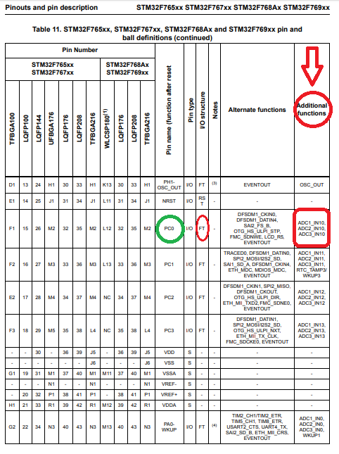
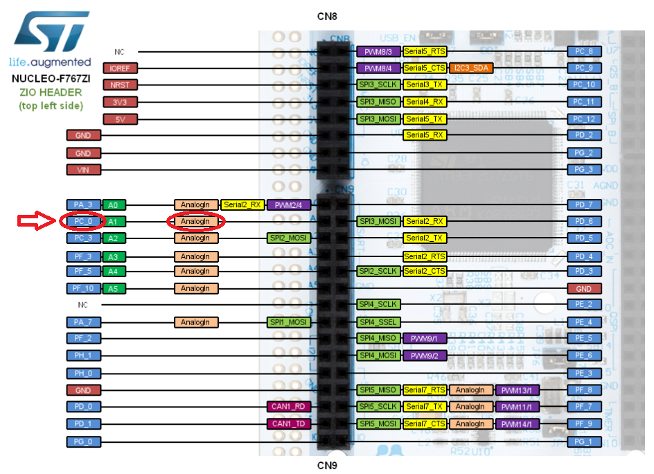
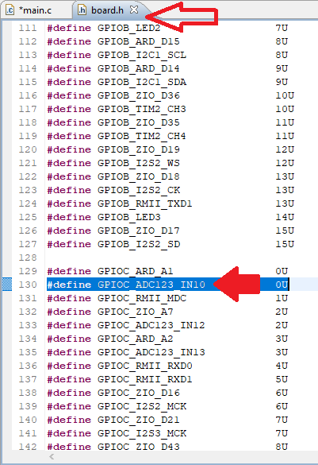

# Как завести АЦП на STM-ке c ChibiOS/HAL

## Первый шаг - выбор каналов АЦП

Определяем какой модуль АЦП у вас свободен и какие пины микроконтроллера (МК) можно использовать в дальнейшем (пины, связанные с АЦП).

> Предположим, что у нас свободен модуль №1 АЦП 

Определяем какие именно пины МК относятся к АПЦ и к каким именно каналам, это можно сделать несколькими способами.

1. Открыть [Datasheet (DS)](https://www.st.com/content/ccc/resource/technical/document/datasheet/group3/c5/37/9c/1d/a6/09/4e/1a/DM00273119/files/DM00273119.pdf/jcr:content/translations/en.DM00273119.pdf#page=65) и в таблице 11 в столбце *Additional functions* найти обозначение канала нужно нам модуля АЦП

<p align="center">

</p>  

Обратите внимание также на пометку *FT* - она обозначает *5V tolerant I/O* (пин может пережить напряжение в 5В :smirk:), что весьма полезно при работе с аналоговыми сигналами.  

Получается что канал 10 модуля АЦП №1 соотвествует пину PC0. Аналогично и с другими каналами. 

> Для примера выберем канал №10 (PC0) и канал №3 (PA3)

> **!!!Обратите внимание**, что один и тот же пин может соответствовать одному и тому же каналу разных модулей АЦП. Если этот пин вы уже использовали для АЦП №1, то для АЦП №2 или №3 не стоит его использовать - может образоваться неистовое страдание при поиске ошибок (=

2. Открыть [графическую распиновку платы](https://os.mbed.com/platforms/ST-Nucleo-F767ZI/) и найти пины с обозначением *AnalogIn*, но определить к какому каналу АЦП и к какому модулю АЦП они принадлежат только по картинке не получится, поэтому всё равно придётся обращаться к [DS](https://www.st.com/content/ccc/resource/technical/document/datasheet/group3/c5/37/9c/1d/a6/09/4e/1a/DM00273119/files/DM00273119.pdf/jcr:content/translations/en.DM00273119.pdf#page=65), но искать по названию пина может быть проще и быстрее. 

<p align="center">

</p>  

3. Открыть файл `<ChibiOS_root>/os/hal/boards/<your_board>/board.h` (из Eclipse на Windows можно открыть `<name_of_your_project>/board/board.h`). Там вы увидите набор define-ов, они сгруппированы по портам (А, В, С, D и т.д.), для каждого пина есть краткое описание и его номер. 
Например:

```cpp
// пин А3 - канал №3 АПЦ №1/ АЦП №2/ АЦП №3 
#define GPIOA_ADC123_IN3            3U
// пин C0 - канал №10 АПЦ №1/ АЦП №2/ АЦП №3
#define GPIOC_ADC123_IN10           0U
```

<p align="center">

</p>

## Второй шаг - Познакомим STM-ку с АЦП

Нужно дать понять МК, что мы хотим использовать модуль АЦП №Х. Об этом написано в [основах работы с модулями](Basics.md) =).

## Третий шаг - Выбор и настройка таймера 

Предположим (зачастую так и бывает), мы хотим, чтобы измерение аналогового сигнала происходило с какой-то постоянной частотой. Для этого удобно использовать таймер. 

Первое, что нужно сделать - это выбрать свободный (неиспользуемый) таймер.

> Возьмём таймер №4, просто потому что (=

Как начать работу с таймеро и оповестить об этом МК написано в [основах работы с модулями](Basics.md) =).

В файле `main.c` осуществляется конфигурация выбранного таймера.

```cpp
/*
 * GPT4 configuration. This timer is used as trigger for the ADC.
 */
static const GPTConfig gpt4cfg1 = {
  .frequency =  100000,
  .callback  =  NULL,
  .cr2       =  TIM_CR2_MMS_1,  /* MMS = 010 = TRGO on Update Event.        */
  .dier      =  0U
  /* .dier field is direct setup of register, we don`t need to set anything here until now */
};
```
> `TIM_CR2_MMS_1` - указание таймеру необходимости передачи сигнала `TRGO` триггера по переполнению (т.к. именно этот таймер мы будем использовать для работы с АЦП)

## Четвёртый шаг - Настройка АЦП

Ну, теперь пойдёт жара :fire:. 

Для начала определим несколько define-ов, которые в последствии будем использовать в настройке АЦП:

```cpp
#define ADC1_NUM_CHANNELS   2
#define ADC1_BUF_DEPTH      1

static adcsample_t samples1[ADC1_NUM_CHANNELS * ADC1_BUF_DEPTH];
```

* `#define ADC1_NUM_CHANNELS   2` - количество каналов, которые мы хотим использовать
* `#define ADC1_BUF_DEPTH      1` - глубина буфера (буфер представляет собой массив, где каждый столбец соответствует снятому значению с определенного [мы каналы чуть позже настроим], глубина - количество строк)
* `static adcsample_t samples1[ADC1_NUM_CHANNELS * ADC1_BUF_DEPTH];` - буфер 

Далее определим две функции, имена которых будем использовать при настройке модуля АЦП:

```cpp
/* ADC streaming callback */
static void adccallback(ADCDriver *adcp, adcsample_t *buffer, size_t n)
{
  (void)adcp;
  (void)buffer;
  (void)n;
}

/* ADC errors callback, should never happen */
static void adcerrorcallback(ADCDriver *adcp, adcerror_t err) {

  (void)adcp;
  (void)err;
}
```
* `static void adccallback(ADCDriver *adcp, adcsample_t *buffer, size_t n)` - функция, которая вызывается, когда АЦП завершит преобразование, её имя можно менять (аналогия с именами переменных), параметры менять нельзя (прототип функции должен иметь конкретный вид)
* `static void adcerrorcallback(ADCDriver *adcp, adcerror_t err)` - функция, которая вызывается, когда происходит какая-либо ошибка. Всё аналогично с предыдущей функцией (имя - можно менять, параметры - нельзя).

> В функциях строки ` (void)adcp;` и т.п используются, чтобы избежать warnings при компиляции, поскольку пока что в этих функциях мы ничего делать не планируем.

Теперь перейдём к непосредственной настройке. Ниже представлен код функции с комментариями.

```cpp
static const ADCConversionGroup adcgrpcfg1 = {
  .circular     = true,                                           // working mode = looped
  .num_channels = ADC1_NUM_CHANNELS,
  .end_cb       = adccallback,
  .error_cb     = adcerrorcallback,
  .cr1          = 0,             
  .cr2          = ADC_CR2_EXTEN_RISING | ADC_CR2_EXTSEL_SRC(0b1100),  // Commutated from GPT
  .smpr1        = ADC_SMPR1_SMP_AN10(ADC_SAMPLE_144),             // for AN10 - 144 samples
  .smpr2        = ADC_SMPR2_SMP_AN3(ADC_SAMPLE_144),              // for AN3  - 144 samples
  .sqr1         = ADC_SQR1_NUM_CH(ADC1_NUM_CHANNELS),
  .sqr2         = 0,
  .sqr3         = ADC_SQR3_SQ1_N(ADC_CHANNEL_IN3) |               // sequence of channels
                  ADC_SQR3_SQ2_N(ADC_CHANNEL_IN10)
  /* If we can macro ADC_SQR2_SQ... we need to write to .sqr2 */
};
```
Заметили, что мы использовали функции и define-ы, определённые ранее :smirk:? 

* `circular` - зацикленный режим работы (вкл/выкл), при подходе к онцу буфера модуль продолжит писать с начала
* `num_channels` - количество каналов (проще задавать с помощью define, одну цифру проще исправить, чем потом по всей программе искать несостыковки)
* `end_cb` - определение функции-callback, которая будет вызываться после завершения преобразования 
* `error_cb ` - определение функции-callback, которая будет вызываться при возникновении ошибки 
* `cr1` - нативный регистр управления АЦП модуля, обычно значение 0
* `cr2` - нативный регистр управления АЦП модуля, здесь можно настроить, будет ли АЦП реагировать на фронт/срез сигнала, а также, как именно будет происходить считывание (по таймеру или по какому-то другому событию), возможные значения:
  - `ADC_CR2_EXTEN_DISABLED` - реакция на прерывание от источника триггера выключено (по-умолчанию)
  - `ADC_CR2_EXTEN_RISING` - реакция на фронт сигнала от источника триггера
  - `ADC_CR2_EXTEN_FALLING` - реакция на срез сигнала от источника триггера
  - `ADC_CR2_EXTEN_BOTH` - реакция на оба события (фронт, срез) от источника триггера
  - `ADC_CR2_EXTSEL_SRC()` - задание источника для реакции АЦП. Возмодные значения можно посмотреть в [Reference Manual (RM)](https://www.st.com/content/ccc/resource/technical/document/reference_manual/group0/96/8b/0d/ec/16/22/43/71/DM00224583/files/DM00224583.pdf/jcr:content/translations/en.DM00224583.pdf#page=451)
* `smpr1` - настройка длительности снятия сигнала (семплирование) с канала, возможные значения:
  - `ADC_SMPR1_SMP_AN[10-15,SENSOR,VREF,VBAT]()` - задание семплирования для каналов 10-15, температурного датчика (только ADC1), опорного напряжения (только ADC1), напряжения батарейки (только ADC1). Возможные значения для макросов:
    - `ADC_SAMPLE_3`
    - `ADC_SAMPLE_15`
    - `ADC_SAMPLE_28`
    - `ADC_SAMPLE_56`
    - `ADC_SAMPLE_84`
    - `ADC_SAMPLE_112`
    - `ADC_SAMPLE_144`
    - `ADC_SAMPLE_480`
* `smpr2` - настройка длительности снятия сигнала с канала, возможные значения:
  - `ADC_SMPR2_SMP_AN[0-9]()` - задание семплирования для каналов 0-9, возможные значения для макросов идентичны `smpr1`


* `sqr1` - регистр настройки последовательности снятия аналогового сигнала и записи в буффер, а также количества каналов для снятия аналогового сигнала за один проход, возможные значения:
  - `ADC_SQR1_NUM_CH()` - макрос задания количества каналов
  - `ADC_SQR1_SQ[13-16]_N()` - макрос задания каналов для порядковых номеров 13-16, возможные значения макроса:
    - `ADC_CHANNEL_IN*` - установить канал на определенную последовательность
* `sqr2` - регистр настройки последовательности снятия аналогового сигнала и записи в буффер, возможные значения:
  - `ADC_SQR2_SQ[7-12]_N()` - макрос задания каналов для порядковых номеров 7-12, возможные значения макроса аналогичные
* `sqr2` - регистр настройки последовательности снятия аналогового сигнала и записи в буффер, возможные значения:
  - `ADC_SQR3_SQ[1-6]_N()` - макрос задания каналов для порядковых номеров 1-6, возможные значения макроса аналогичные

> Для полей `sqr[1-3]` задание колчестве каналов ограничивает возможное задание номера последовательности. Так, если был задан `ADC_SQR1_NUM_CH(4)`, то использование макроса `ADC_SQR2_SQ7_N(..)` не имеет смысла.


> Как видно, чтобы настроить несколько каналов в один регистр, последовательность `sqr*` или длительность `smpr*` снятия сигнала, небходимо использовать бинарное ИЛИ - символ "|"

## Пятый шаг - функция `main(void)`

В функции `main(void)` необходимо осуществить инициализацию модулей, которые мы используем, запустить АЦП и таймер. 

```cpp
int main(void)
{
    chSysInit();
    halInit();
        
    gptStart(&GPTD4, &gpt4cfg1);
    // ADC driver
    adcStart(&ADCD1, NULL);
    palSetLineMode( LINE_ADC123_IN10, PAL_MODE_INPUT_ANALOG );  // PC0
    palSetLineMode( LINE_ADC123_IN3, PAL_MODE_INPUT_ANALOG );   // PA3
    
    adcStartConversion(&ADCD1, &adcgrpcfg1, samples1, ADC1_BUF_DEPTH);
    gptStartContinuous(&GPTD4, gpt4cfg1.frequency/1000);          // how often we need ADC value
    /* Just set the limit (interval) of timer counter, you can use this function
       not only for ADC triggering, but start infinite counting of timer for callback processing */
    
    while (true);
}
```
Теперь при настройке мы задаем через функцию `gptStartContinuous()` вторым аргументом, до какого значения будет считать таймер (в нашем случае `100000/1000 = 100` - 100 тиков таймера). В момент подхода счета таймера к данному значению таймер переполнится, сбросит счётчик и вызовет триггер, который дёрнет АЦП снимать сигнал. Вспомним, как посчитать период переполнений - [количество тиков таймер / частоту работы таймера]. В нашем случае = `100/100000 = 1/1000 [c] = 1 [мс]`. То есть, АЦП будет вызвано триггерами таймера с частотой 1 кГц. Зная с какой частотой мы хотим тригерить таймер - можно рассчитать значение - в данном случае это значение `1000`. 

Так как мы задали режим работы `circular` и запустили АЦП с помощью `adcStartConversion()`, то у нас с расчитанной частотой будет вызываться callback функция преобразования АЦП, из которой потом можно достать снятые значения. В момент вызова callback функции по преобразованию в буфере АЦП уже заполнены значения каждого канала.

> Данный функционал рассмотрен при значении `ADC*_BUF_DEPTH == 1`, при большей глубине буфера преобразования вызываются по тому же принципу, а callback функция дергается по заполнению половины глубины буфера и всего буфера. **Для начала рекомендуется разобраться с работой АЦП при единичной глубине!**

Чтобы проверить работоспособность, можно использовать осциллограф, а также прикрутить протокол передачи данных (например, UART) - выводить данные с потенциометра во внутренний терминал Eclipse ^___________^ 


## Полезные ссылки

* [Видео / Теория АЦП на примере STM32F407](https://www.youtube.com/watch?v=xEcWdGznDUI)