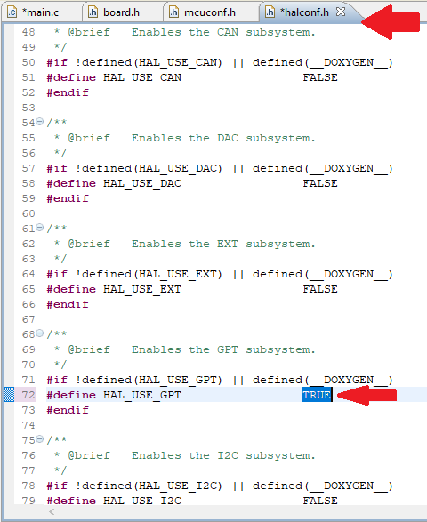
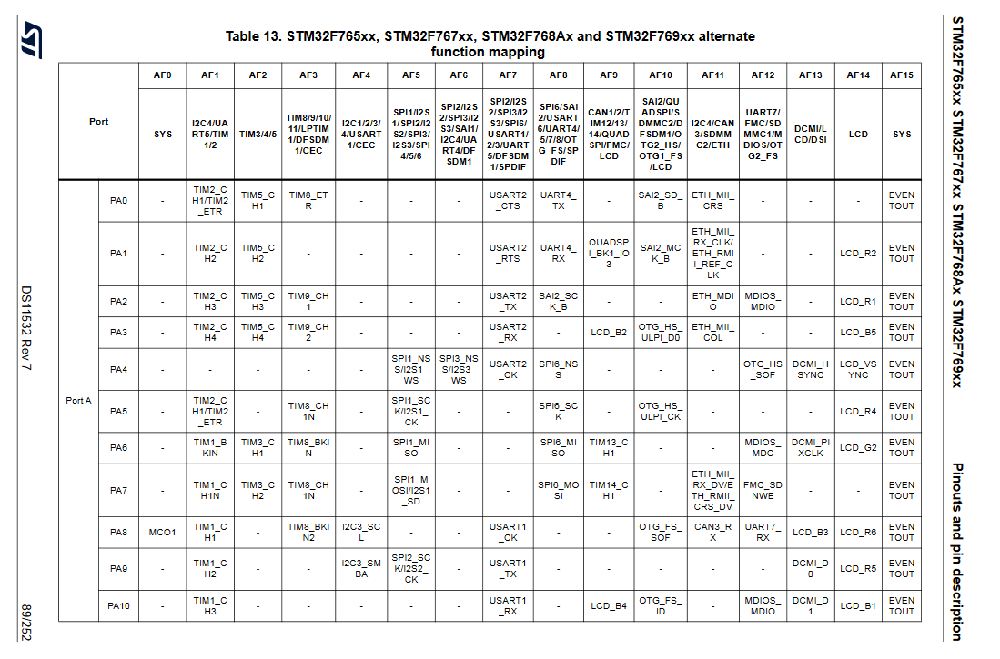

# HAL?

'HAL' - Hardware Abstraction Layer, или же уровень аппаратных абстракций, это набор программных модулей, управляющих различными инструментами микроконтроллера. Под инструментами подразумевается вся перифирия, различные вычислительные модули, вынесенные из ядра процессора, и т.д. В `ChibiOS` `HAL` абсолютно независим и может использоваться отдельно от операционной системы и не является необходимым для работы `RT` модуля.

В отличии от реализаций, связанных с автогенерацией кода в зависимости от выбранных настроек, в `ChibiOS` модули уже написаны под все поддерживаемые платформы и хранятся в виде исходного кода в недрах папки `chibios203`, а точнее в /os/hal. Так как все эти файлы довольно много весят, а зачастую еще и конфиликтуют, при компиляции в сборку попадают далеко не все. За то чтобы случайно не использовать файлы не от того контроллера отвечает `makefile`, а чтобы не подключать ненужную периферию используются заголовочные файлы `halconf.h` и `mcuconf.h`, находящиеся в папке проекта `cfg`.

## Включение модулей

Чтобы подключить к проекту желаемый модуль необходимо установить соответствующий `define` в файле `halconf.h` в состояние `TRUE`. Неиспользуемые модули лучше выключать написав `FALSE`, хотя катастрофы, конечно, не произойдет.

Также, если промотать файл вниз можно найти дополнительные опции, связанные с работой модулей. Например, использование внешних прерываний для модуля `PAL` или использование функций `Advanced` таймера.

Помимо включения вмодуля в принципе в большинстве случаев еще надо будет включить конкретный драйвер. Разделение на драйверы связано с тем, что внутри контроллера может быть множество одинаковых модулей. Например, всегда есть несколько таймеров, или может быть несколько независимых модулей `i2c`. Для этого надо найти в файле `mcuconf.h` блок определений, связанный с необходимым модулем. Выбрав желаемый драйвер точно так же переводим его в состояние `TRUE`.

Некоторые дрейвера могут конфликтовать друг с другом. Например, модули `GPT` и `PWM` на самом деле используют одни и те же таймеры. Поэтому если попытаться включить `TIM1` и `PWM1` получим ошибку. Здесь же для некоторых модулей можно задать канал `DMA` или какие-либо специфичные настройки, но тут об этом говорить не будем.

## Выбор драйвера

Обычно, между разными драйверами одного модуля отличий нет. Хотя, например, таймеров много разных, причем отличия достаточно существенные. Возможная причина выбрать тот или иной драйвер заключается в используемых им ногах. Если модуль может использовать каки-либо ноги микроконтроллера, а это, например, все модули периферии, то разные драйвера бдут использовать разные ноги. Узнать какие ноги на каком драйвере висят можно из даташита, а именно в табличке альтернативных функций. Здесь приведен пример для отладочной платы `NUCLEO-F767ZI`, но найти на любой другой контроллер семейства `STM32` проблемы не должно составить.

## Использование модулей

В целом, использование будет уникально для каждого модуля, и будет описано в отдельных инструкциях. Однако можно выделить несколько общих моментов:

  - Все доступные для использования функции (так называемый `API`) пишутся только с помощью `Camel Case` и начинаются с префикса по имени модуля. Например, `palSetLineMode()`. Если нашли что-нибудь написанное с помощью `Snake Case`, например `pal_lld_setport()`, *не надо* этим пользоваться!
  - Все функции делятся на классы:
    - `Normal Class` - функции этого класса можно вызывать только в потоках. Например, в `main()` или любой функции, которую из мейна вызвали. По сути это значит, что нельзя такую функцию вызывать из прерывания или `Lock` зон. В имени функции никаких отличительных знаков нет.
    - `S-Class` - функции `S` класса можно вызывать только критических зон потока. Подробнее можно почитать [тут](../RT_topics/RTOS_Critical_Zones.md). Фунцкии заканчиваются на букву `S`. Примера из `HAL` не нашел.
    - `I-Class` - Функции `I` класса можно вызывать прерываний, критических зон потока и критических зон прерываний. Прерываниями являются все `callback` функции, которые могут вызывать различные модули. Например, прерывание по таймеру, прерывание по изменению состояния на ноге, прерывание по окончанию передачи данных по `SPI` и так далее. Функции заканчиваются на букву `I`, например `adcStartConversionI()`
    - `X-Class` можно вызывать откуда угодно. Функции заканчиваются на букву `X`, например `icuGetWidthX()`.
    - `Special` не относятся к функциям какого-либо класса и по большей части функциями они и не являются. Сюда относится вся работа с ногами, напрмиер `palToggleLine()`. Отличить `Normal Class` от `Special` можно только с помощью хелпа.
  - Любой модуль надо запустить с помощью 
