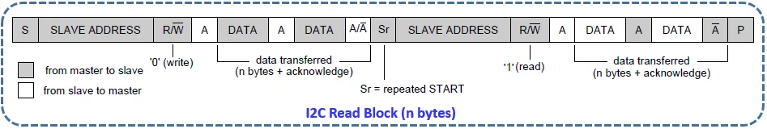

# Инструкция по работе с драйвером I2C

## Что такое I2C?

`I2C` - драйвер, управляющий, как это ни странно, `i2c` интерфесом. Контроллеры от ST поддерживают работу в режимах как ведущего, так и ведомого (maste-slave), однако в `ChibiOS` реализован функционал только мастера. 
Так что если Вы планировали разработать устройство, которое бы общалось с другими контроллерами, у меня плохие новости.

Однако, вернемся к режиму мастера.

Чтобы включить драйвер, как и для любого модуля, необходимо в `halconf.h` установить `HAL_USE_I2C` в состояние `TRUE`. А так же в `mcuconfig.h` включить хотя бы один из модулей, установив один или несколько `STM32_I2C_USE_I2Cx` в состояние `TRUE`, где `x` - номер устройства. Если не понимаешь о чём речь - [смотри сюда](Basics.md)

Все модули работают абсолютно одинаково, поэтому руководствуйтесь исключительно выбором свободой ножки МК. Посмотреть какой модуль на какой ноге можно по [картинке](https://os.mbed.com/platforms/ST-Nucleo-F767ZI/). **ВАЖНО!! В графической распиновке показаны НЕ ВСЕ функции пинов. БУДЬТЕ ВНИМАТЕЛЬНЫ!!!** 

<p align="center">

</p>

или по [таблице альтернативных функций](https://www.st.com/content/ccc/resource/technical/document/datasheet/group3/c5/37/9c/1d/a6/09/4e/1a/DM00273119/files/DM00273119.pdf/jcr:content/translations/en.DM00273119.pdf#page=89) 
 
> Ссылки даны на информацию по контроллеру STM32F767ZI, обязательно ищите актуальную информацию по своему контроллеру!

## Запуск I2C

Запуск `i2c` осуществляется с помощью функции
```c
i2cStart(&i2c_driver, &i2c_config);
``` 

С драйвером всё просто, необходимо передать указатель на драйвер выбранного устройства. Имя драйвера `I2CDx`, где `x` - номер того самого подключенного устройства. 

Может возникнуть желание положить указатель в переменную, чтобы не вспоминать каждый раз про операнд взятия адреса, для этого существует тип `I2CDriver`. Например,
```c
static I2CDriver *i2c1 = &I2CD1;
```

Тогда запуск `i2c` будет такой 
```c
i2cStart(i2c1, &i2c_config);
``` 

## Кофигурация I2C

А вот со структурой конфигурации всё немного сложнее. 

Во-первых, она зависит от версии драйвера, которая в свою очередь зависит от контроллера. 

Есть три версии драйвера `i2c`: `I2Cv1`, `I2Cv2` и `I2Cv3`. Узнать которая у Вас можно с помощью [таблички](README.md).

Сначала рассмотрим вариант с первой версией драйвера. Для задания конфигурации необходимо заполнить следующую структуру:

```c
typedef struct {
  i2copmode_t     op_mode;       // Режим работы
  uint32_t        clock_speed;   // Частота тактирования (aka скорость передачи)
  i2cdutycycle_t  duty_cycle;    // Длительность импульсов
} I2CConfig;
```

Первое поле допускает три варианта режима работы:

  - `OPMODE_I2C` - скорее всего, это то, зачем Вы пришли;
  - `OPMODE_SMBUS_DEVICE` - `System Management Bus` протокол, основанный на `i2c`, в основном использующийся в материнских платах и для общения с устройствами питания. Вероятнее всего никогда не понадобится.
  - `OPMODE_SMBUS_HOST` - см. выше.

Поле `clock_speed` содержит значение частоты. В принципе можно написать всё, что угодно до 400000 (400кГц), однако стандартом протокола описаны следующие режимы:

  - `Low-speed` - 10кбит/с;
  - `Standard` - 100кбит/с;
  - `Fast` - 400кбит/с;
  - `Fast plus` - 1Мбит/с (не поддерживается в `i2cv1`);
  - `High-speed` - 3.4Мбит/с (не поддерживается в `i2cv1`);
  
Последнее поле допускает варианты:

  - `STD_DUTY_CYCLE` - ставьте это, если используете стандартный режим работы;
  - `FAST_DUTY_CYCLE_2` - либо это, если используете быстрый режим работы.
  - `FAST_DUTY_CYCLE_16_9`

Если же используется вторая или третья версия драйвера, структура преображается и содержит другие три поля:

```c
typedef struct {
    uint32_t        timingr;
    uint32_t        cr1;
    uint32_t        cr2;
} I2CConfig;
```

С одной стороны, названия полей подсказывают, что это регистры `i2c` `TIMING_REGISTER`, `CONTROL_REGISTER1` и `CONTROL_REGISTER2`, но жить с этим легче не становится.

Если заглянуть в даташит (это верно, как минимум для SMT32F767), можно узнать, что `TIMING_REGISTER` разбит на пять полей: 
`PRESC`, `SCLDEL`, `SDADEL`, `SCLH`, `SCLL` и в `ChibiOS` есть дефайны, задающие значения в соответствующие поля, например, `STM32_TIMINGR_PRESC`. И даже даны формулы как посчитать. 
А ещё там даны [таблицы](https://www.st.com/content/ccc/resource/technical/document/reference_manual/group0/96/8b/0d/ec/16/22/43/71/DM00224583/files/DM00224583.pdf/jcr:content/translations/en.DM00224583.pdf#page=1206) 
с некоторыми расчетами, за что им прям человеческое спасибо!

### Дальше пойдет довольно скучная информация, которую при желании можно пропустить.

> Рассмотрим пример для следующего случая. Частота тактирования модуля `i2c` - 48МГц, желаемая частота передачи - 100кГц.
Так как за частоту отвечает линия тактирования SCL, то чтобы добиться частоты 100кГц нужно обеспечить сумму длительностей высокого и низкого состояний линии равной 10мс. 
Для этого есть три прескейлера, один глобальный и два для низкого и высокого состояний.
В [таблице 208](https://www.st.com/content/ccc/resource/technical/document/reference_manual/group0/96/8b/0d/ec/16/22/43/71/DM00224583/files/DM00224583.pdf/jcr:content/translations/en.DM00224583.pdf#page=1207) значение глобального прескейлера указано 0xB, 
то есть 12 (если подсмотреть в описание регистра `TIMING_REGISTER`, можно увидеть, что прескейлер равен 1 + введённое значение), 
значение прескейлера низкого состояния `0x13`, или 20 человеческим языком, а значение прескейлера высокого состояния - `0xF`, оно же 16. Давайте считать:

> Длительность высокого состояния находится как:
`t_sclh = 1 / (48000000 / (12 \* 16 ) = 0.000004 сек`
Для низкого состояния:
`t_scll = 1 / (48000000 / (12 \* 20 ) = 0.000005 сек`

> Иии... получается 9 мкс, вместо 10. Однако ST выкрутились и написали, что на самом деле период чуть больше, так как какое-то время уходит, чтобы увидеть отпущенную другим устройством линию.
 
> Оставшиеся два поля регистра задают длительности пауз от нарастающего фронта линии `SDA`, до нарастающего фронта линии `SCL` и от падающего фронта `SCL` до падающего фронта `SDA`. 
Если не понятно зачем это надо, можно почитать про работу `i2c`. Или поесть, тоже должно отпустить. В любом случае это не такие важные параметры и из таблички можно подсмотреть, 
что диапазон значений - сотни наносекунд - одна микросекунда.
В любом случае, на самом деле частота `i2c` может уплывать, если какое-либо из устройств не успевает, поэтому в принципе можно взять любую рабочую конфигурацию и, 
независимо от частоты контроллера, скорее всего как-то модуль заработает. Однако давайте всё-таки посчитаем для нашего случая.
 
> Попробуем посчитать значения `TIMING_REGISTER` для NUCLEO-F767ZI.

> Первая возникшая проблема, а какая частотота тактирования `i2c`? Чтобы ответить на этот вопрос, необходимо узнать кто её тактирует. 
Так как все настройки описаны в файле `mcuconf.h` идём смотреть там. Находим дефайны `STM32_I2C1SEL` (и ещё 3 штуки на оставшиеся драйверы) и видим новый дефайн `STM32_I2C1SEL_PCLK1`, 
причём одинаковый для всех `i2c`. Провалившись в него убеждаемся, что это действительно выбор источника тактирования для `i2c`, здорово! Недолго думая начинаем искать, 
что же такое `PCLK1` и действительно находим дефайн `STM32_PCLK1` в файле `hal_lld.h`. А это в свою очередь `STM32_HCLK / 4` (ну или смотря какой прескейлер выбран в конфиге). 
`STM32_HCLK` - частота тактирования процессора, но тут я поленился её считать и просто отправил по usb в терминал. Оказалась 216МГц. Таким образом частота тактирования `i2c` - 54МГц.

> Выберем желаемую частоту - 100кГц, то есть стандартный режим работы `i2c`. Так как поле `PRESC` это всего 4 бита, то максимальное значение, которое можно задать это 16.
Выберем 15, чтобы получилось чуть более красивое значение - 3,6МГц. Не забудьте, что в регистр надо класть желаемое значение минус один, то есть 14 или `0xE`.
Чтобы получить 10мкс период тактирования, нужно получить длительности высокого и низкого состояний близкие к 5мкс, а значит частота должна быть около 200кГц.
Удача! `3,6 / 0,2 = 18`, то есть в поле `SCLL` можно положить числа 17 или `0x11`. Поверим, что высокое состояние должно быть чуть короче и выберем прескейлер 15, это даст длительность
высокого состояния 4.17мс. Соответственно в поле `SCLH` положим значение 14, или `0xE`. Над `SDADEL` и `SCLDEL` долго думать не будем. С выбранным прескейлером один так длится ~278нс,
Тогда пусть открывающая пауза будет три такта, а закрывающая - два. Обратите внимание, в регистрах `SDADEL` и `SCLDEL` запасённой единички нет (чтобы можно было поставить ноль), 
так что пишем что насчитали. 

Итоговая конфигурация для STM32F767ZI:
```c
static const I2CConfig i2c1_conf = {
 .timingr = STM32_TIMINGR_PRESC(14U)  |
 STM32_TIMINGR_SCLDEL(3U)  | STM32_TIMINGR_SDADEL(2U) |
 STM32_TIMINGR_SCLH(14U)   | STM32_TIMINGR_SCLL(17U),
 .cr1 = 0,
 .cr2 = 0
};
```

Остальные два регистра остались нетронутыми, поскольку там настраиваются режимы не поддерживаемые в `СhibiOS`, а ещё там довльно страшно. 

Комментарий в описании структуры (`Leave to zero unless you know what you are doing`) тоже не слишком обнадёживает, так что пусть будут нули.

# А теперь, собственно работа драйвера

На самом деле, модуль довольно простой, особенно учитывая, что чтобы настроить совсем неправильно надо постараться. Всего есть 7 функций:

```c
void i2cStart(I2CDriver *i2cp, const I2CConfig *config);
void i2cStop(I2CDriver *i2cp);
i2cflags_t i2cGetErrors(I2CDriver *i2cp);
msg_t i2cMasterTransmitTimeout(I2CDriver *i2cp,
                                i2caddr_t addr,
                                const uint8_t *txbuf, size_t txbytes,
                                uint8_t *rxbuf, size_t rxbytes,
                                sysinterval_t timeout);
msg_t i2cMasterReceiveTimeout(I2CDriver *i2cp,
                                i2caddr_t addr,
                                uint8_t *rxbuf, size_t rxbytes,
                                sysinterval_t timeout);
void i2cAcquireBus(I2CDriver *i2cp);
void i2cReleaseBus(I2CDriver *i2cp);
```

Как уже было сказано, `i2cStart()` запускает драйвер, ну а `i2cStop()`, очевидно, останавливает.

`i2cGetErrors()` возвращает флаги ошибок, аргументом является указатель на драйвер, например, `&I2CD1`. В принципе этим не обязательно пользоваться, но, можно например что-нибудь сделать, если не пришел `ACK` бит. Может так произойти, что ошибок окажется несколько, поэтому надо понимать как выглядит маска. Если все нули, то ошибок нет.

|Номер бита|6|5|4|3|2|1|0|
|---|----|----|----|----|----|----|----|
|Ошибка|`I2C_SMB_ALERT`|`I2C_TIMEOUT`|`I2C_PEC_ERROR`|`I2C_OVERRUN`|`I2C_ACK_FAILURE`|`I2C_ARBITRATION_LOST`|`I2C_BUS_ERROR`|`I2C_NO_ERROR`|

`i2cMasterTransmitTimeout()` - передача данных по `i2c`. Так как сейчас почти у всех ведомых устройств достаточно сложная структура с множеством регистров для чтения/записи, 
функция повторного старта есть по умолчанию. Заключается она в следующем: сначала мастер обращается к устройству в режиме `Запись`, затем, передав всю необходимую информацию совершает операцию `Старт` (`Стоп` при этом не происходит) и обращается к тому же самому устройству, но уже в режиме `Чтение`. Самый частый пример - чтение данных из регистра устройства. Мастер записывает желаемый адрес и затем начинает читать. Не смотря на то, что подобный вариант работы не является стандартом, его используют практически все современные устройства.

<p align="center">

</p>

Аргументами функции являются:

  - `i2cdriver` - указатель на используемый драйвер;
  - `addr` - 7 бит адреса ведомого устройства (`r/w` бит писать НЕ надо);
  - `txbuf` - указатель на массив, в котором лежат данные для передачи (тип `uint8_t`, если указать другой тип при приведении типов могут появится лишние нулевые байты);
  - `txbytes` - количество байт на отправку, если превысить размер массива `txbuf` можно начать слать что-нибудь неизвестное;
  - `rxbuf` - указатель на массив, в который попадут полученные данные (тип `uint8_t` по аналогичной причине);
  - `rxbytes` - количество байт на чтение, если превысить размер массива `rxbuf` перепишутся соседние переменные, что, вероятнее всего, приведет к катастрофе;
  - `timeout` - если за время таймаута операция не завершится, поток пойдет дальше. Как обычно, есть значения `TIME_IMMEDIATE` (в данном случае бесполезное), `TIME_INFINITE`, или можно воспользоваться `chTimeMS2I()` (или аналогичными) для пересчета времени в интервал в тиках.
  
Возвращает функция значение типа `msg_t`, с возможными вариантами `MSG_OK`, `MSG_RESET`, `MSG_TIMEOUT`.

Если ничего не хочется передавать, можно указать вместо `txbuff` `NULL`, а число байт - 0 (хотя не очень понятно зачем). Аналогично, можно решить ничего не читать, т.е. `rxbuf` - `NULL`, `rxbytes` - 0.

И есть функция `i2cMasterTransmit()` с теми же самыми аргументами, кроме таймаута. Собственно это просто редифайн `i2cMasterTransmitTimeout()` с последним аргументом `TIME_INFINITE`.

Чтобы только получить информацию можно воспользоваться функцией `i2cMasterReceiveTimeout()` со следующими аргументами:

  - `i2cdriver`
  - `addr`
  - `rxbuf`
  - `rxbytes`
  - `timeout`
  
Поведение такое же как у `i2cMasterTransmitTimeout()`, и точно так же возвращает значение типа `msg_t`. Аналогично есть функция с бесконечным таймаутом `i2cMasterReceive()`.

Если один и тот же драйвер может быть использован в разных потоках, для избежания конфликтов можно занять шину на время использования с помощью функции `i2cAcquireBus()`. Единственный аргумент - указатель на драйвер.

Если попытаться получить контроль над занятым драйвером, то поток будет ждать, пока драйвер не освободится, так что как только завершили передачу данных, отпустите шину с помощью `i2cReleaseBus()`.
Включение последних двух функций осуществляется установкой `I2C_USE_MUTUAL_EXCLUSION` в состояние `TRUE` в `halconf.h`.


## Важное замечание!

Так как на нижнем уровне модуль работает на прерываниях, использование функций в `callback` функциях (например, по таймеру) невозможно, это приведет к зависанию контроллера. 
Так что если необходимо соблюдать периодичность передачи данных и отвязаться от мэйна, запускайте дополнительный поток.

## Ну и, наконец, пример

Код для платы NUCLEO-F767ZI
```c
#include "ch.h"
#include "hal.h"

// Задаем конфигурацию драйвера, частота тактирования i2c 54МГц
static const I2CConfig i2c1_conf = {
    .timingr = STM32_TIMINGR_PRESC(14U)  |
    STM32_TIMINGR_SCLDEL(3U)  | STM32_TIMINGR_SDADEL(2U) |
    STM32_TIMINGR_SCLH(14U)   | STM32_TIMINGR_SCLL(17U),
    .cr1 = 0,
    .cr2 = 0
};

// Запишем указатель на драйвер в переменную
static I2CDriver* i2c1 =  &I2CD1;

int main(void) {
    halInit();
    chSysInit();
    // Запустим дравйвер
    i2cStart(i2c1, &i2c1_conf);
    // Переведем ноги B8 и B9 в режим i2c1
    palSetLineMode(PAL_LINE(GPIOB, 8), PAL_MODE_ALTERNATE(4));
    palSetLineMode(PAL_LINE(GPIOB, 9), PAL_MODE_ALTERNATE(4));
    // Создадим массивы для записи и чтения данных
    uint8_t txbuf[1] = {0x0F};
    uint8_t rxbuf[1] = {0};
    // Прочитаем с устройства с адресом 1101010 значение из регистра по адресу 0x0F (регистр WHO_AM_I гироскопа l3gd20h)
    msg_t msg = i2cMasterTransmitTimeout(i2c1, 0b1101010, txbuf, 1, rxbuf, 1, 1000);
    // Если полученное значение соответсвует ожидаемому, зажжем первый светодиод  
    if (rxbuf[0] == 0b11010111) palSetLine(LINE_LED1);
    // Проверим наличие ошибок
    i2cflags_t flag = i2cGetErrors(i2c1);
    // Если не пришел ACK бит, зажжем второй светодиод
    if (flag == I2C_ACK_FAILURE) palSetLine(LINE_LED2);
    while (true) {
        chThdSleepMilliseconds(1000);
    }
}
```
