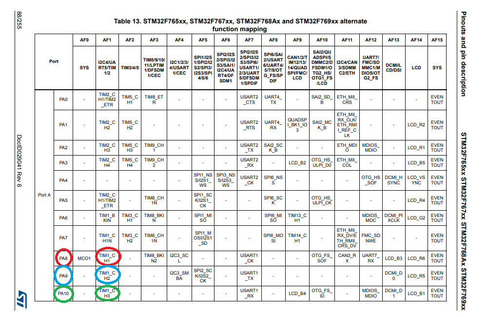
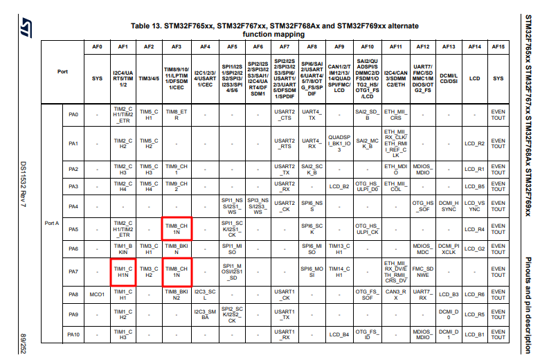
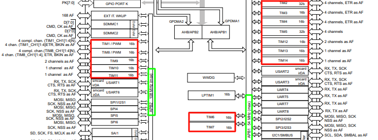
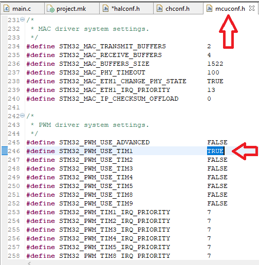
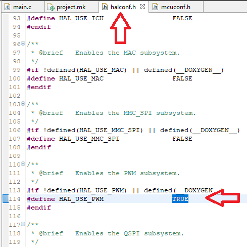

# Как завести ШИМ на STM-ке

## Первый шаг - выбор модуля ШИМ

Первое, что нужно сделать - это определиться какой таймер у вас свободен/какие пины микроконтроллера (МК) свободны. Исходя из этого тайного знания можно настраивать систему. 

> Предположим, мы знаем, что у нас свободен таймер №1 и мы хотим его использовать для генерации ШИМ

## Второй шаг - определение пинов

Определиться какие именно пины МК принадлежат выбранному модулю ШИМ. Это можно сделать 3 способами: 

1. Открыть Datasheet (DS) на странице с [F767ZI Alternate functions](http://www.st.com/content/ccc/resource/technical/document/datasheet/group3/c5/37/9c/1d/a6/09/4e/1a/DM00273119/files/DM00273119.pdf/jcr:content/translations/en.DM00273119.pdf#page=89) и найти пины, в фукнциях которых обозначена их принадлежность к одному из каналов таймера №X (в нашем случае к таймеру №1)

<p align="center">

</p>

2. Открыть страницу с [графической распиновкой платы](https://os.mbed.com/platforms/ST-Nucleo-F767ZI/) и найти пины, принадлежащие к таймеру №Х. **ВАЖНО!! В графической распиновке показаны НЕ ВСЕ функции пинов. БУДЬТЕ ВНИМАТЕЛЬНЫ!!!** 

<p align="center">

</p>

3. Открыть файл `<name_of_your_project>/board/board.h` - это удобно делать из Eclipse. Там вы увидите набор define-ов, они сгруппированы по портам (А, В, С, D и т.д.), для каждого пина есть краткое описание и его номер. Например:

```cpp
// пин G9 - канал №1 таймера №1 
#define GPIOE_TIM1_CH1              9U
// здесь очевидно 
#define GPIOC_BUTTON                13U
```

<p align="center">

</p>

Самый неудобный способ, потому что приходится разбираться в сокращениях и специфичной форме записи. Но, если кому-то нравится этот способ, то разницы, как вы определите нужные вам пины - нет :grin:

## Третий шаг - Познакомим STM-ку с ШИМ

Нужно дать понять МК, что мы хотим использовать ШИМ, и что мы хотим использовать модуль ШИМ с таймером №Х. Для этого нужно сделать 2 действия:

1. В файле `mcuconf.h` (он разположен в папке проекта - удобно открывать через Eclipse) найти секцию, посвящённую настройкам ШИМ и присвоить значение `TRUE` нужному модулю.

<p align="center">

</p>

**СОХРАНИТЕ ВСЕ ИЗМЕНЕНИЯ В ФАЙЛАХ, по умолчанию ничего не сохраняется!**

2. В файле `halconf.h` (он разположен в папке проекта - удобно открывать через Eclipse) найти секцию, посвящённую режиму работы ШИМ и присвоить значение `TRUE` - тем самым разрешая работу всех модулей ШИМ (которые вы выбрали в предыдущем пункте 1).

<p align="center">

</p>

**СОХРАНИТЕ ВСЕ ИЗМЕНЕНИЯ В ФАЙЛАХ, по умолчанию ничего не сохраняется!**

## Четвёртый шаг - Настройка ШИМ

Теперь когда МК знает, что у него в теле включили ШИМ да ещё и с таймером №Х - пора писать код (:smiling_imp: хо-хо-хо). 

Настроим ШИМ на частоту 50 Гц (20 мс) с использованием 1-го канала
```cpp
PWMConfig pwm1conf = {
    .frequency = 500000,
    .period    = 10000,	 
    .callback  = NULL,
    .channels  = {
                  {.mode = PWM_OUTPUT_ACTIVE_HIGH, .callback = NULL}, // Channel 1 is working CH1 = PE9		
                  {.mode = PWM_OUTPUT_DISABLED,    .callback = NULL},
                  {.mode = PWM_OUTPUT_DISABLED,    .callback = NULL},
                  {.mode = PWM_OUTPUT_DISABLED,    .callback = NULL}
                  },
    .cr2        = 0,
    .dier       = 0
};
```
В этой структуре происходит основная настройка параметров работы ШИМ

* `pwm1conf` - имя модуля, название переменной структуры (аналогия с названием переменной, чувствуете?:smirk:). 
* `.frequency` - частота работы (таймера)  
* `.period` - период работы ШИМ (таймера до переполнения [тики])

> Чтобы посчитать период работы ШИМ можно воспользоваться следующей формулой: PWM_period [s] = period / frequency 

* `.callback` - это функция, которая будет вызвана когда модуль сравнения увидит превышение значения таймера над ним (формально в момент среза при прямом ШИМ). Сейчас здесь стоит значение `NULL` - следовательно никакая функция вызвана не будет
* `.channels` - перечень каналов, сверху - вниз от 1-го до 4-го. В графе `.mode` - указывается режим работы ШИМ (прямой/инвертированный/выкл)
* `.cr2` и `.dier` - регистры таймера, которые переносятся напрямую в сам таймер, для работы достаточно значений по умолчанию 0, подробнее - обнимайтесь с [Reference manual (RM)](http://www.st.com/content/ccc/resource/technical/document/reference_manual/group0/96/8b/0d/ec/16/22/43/71/DM00224583/files/DM00224583.pdf/jcr:content/translations/en.DM00224583.pdf) (О, да, там 1954 страницы ^______^)

```cpp
int main(void)
{
    chSysInit();
    halInit();

    palSetLineMode( PAL_LINE( GPIOE, 9 ),  PAL_MODE_ALTERNATE(1) );
    pwmStart( &PWMD1, &pwm1conf );
    pwmEnableChannel( &PWMD1, 0, 5000 );

    while (true);
}
```

* `palSetLineMode( PAL_LINE( GPIOE, 9 ),  PAL_MODE_ALTERNATE(1) );` - настройка пина PG9 на работу с таймером (номер функции берётся из [Datasheet](http://www.st.com/content/ccc/resource/technical/document/datasheet/group3/c5/37/9c/1d/a6/09/4e/1a/DM00273119/files/DM00273119.pdf/jcr:content/translations/en.DM00273119.pdf#page=89))

* `pwmStart( &PWMD1, &pwm1conf );` - старт ШИМ
* `pwmEnableChannel( &PWMD1, 0, 5000 );` - указание скважности в тиках таймера, если период = 10000, то указывая 50000 - скважность будет составлять 50%, 0 - это 1-й канал ШИМ (нумерация начинается с 0-ля).

**!!!!** Не забывайте, что таймеры бывают разные (16-битные, 32-битные в стм-ке в частности). Посмотреть кто из них кто можно в [табличке из DS](https://www.st.com/content/ccc/resource/technical/document/datasheet/group3/c5/37/9c/1d/a6/09/4e/1a/DM00273119/files/DM00273119.pdf/jcr:content/translations/en.DM00273119.pdf#page=38) Это повлияет на максимальное значение, которое можно зависать в скважность и период таймера. 
* 16-битный таймера -> max = 2^16-1 
* 32-битный таймер -> max = 2^32-1

Сохарняем изменения, собираем проект и вооружаемся осциллографом! Успехов! 

> Если хочется более наглядных результатов, то LED1 сидит на PB0 - заставьте его пылать ^_________^

