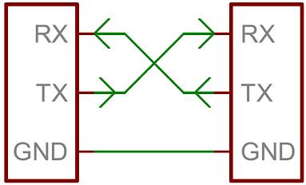

# Инструкция по работе с драйвером SERIAL

## Содержание <a id="content"></a>

* [Что такое Serial?](#serial)
* [Запуск Serial](#run)
* [Кофигурация Serial](#config)
* [Работа драйвера Serial](#usage)
* [Работа с терминалом через chprintf.h](#chprintf)
* [Несколько примеров](#example)

## Что такое Serial? <a id="serial"></a>

`Serial interface` - интерфейс последовательной передачи данных. То есть любой интерфейс, который предполагает передачу данных бит за битом является последовательным. Это, например, `i2c`, `spi`, `COM`, `Ethernet` и т.д.

Все последовательные интерфейсы можно разбить на 3 типа:

  - симплекс - передача данных возможна только в одном направлении;
  - полудуплекс - передача данных возможна в двух направлениях, но не одновременно;
  - дуплекс - передача данных осуществляется в обоих направлениях одновременно.

Также интерфейсы передачи данных можно разбить на синхронные и асинхронные. Первый случай подразумевает наличие общего таймера и синхронизирующей линии (например `i2c` и `spi`), в то время как у асинхронного интерфеса тактирование происходит независимо на каждом устройстве (`UART`).

Несмотря на неочевидность терминологии, обычно под последовательным интерфейсом понимают `COM` (RS-232) и пришедший ему на смену `USB`. 

RS-232 это устоявшийся стандарт реализации `UART` - универсального асинхронного приёмо-передатчика. Несмотря на то, что `USB` это не `RS-232`, операционная система умеет воспринимать подключенное `USB` устройство как виртуальный `COM` порт. И существует достаточно много технических решений по преобразованию `RS-232` или `UART` в `USB`. Например, на большинстве отладочных плат от `ST`, таких как `Nucleo` или `Discovery` присутствует преобразователь `UART` - `USB`, что позволяет видеть плату как виртуальный `COM` порт.

И тут мы подбираемся непосредственно к контроллеру. В большинстве МК есть аппаратная реализация `USART`. `USART` - полное название модуля, Universal Synchronous Asynchronous Reciever Trasmitter. То есть модуль способен реализовать как синхронный, так и асинхронный интерфейсы. 

В `ChibiOS` для этого есть драйверы `UART` (если в этот момент Вы начали сходить с ума, нужна ли буква `S` в названии, то Вы не одиноки. В самом `ChibiOS` файл `hal_uart_lld` лежит в директории `USARTv2`. 

Чтобы все сохранили рассудок, в дальнейшем будет использоваться аббревиатура `UART`, кроме случаев, где разделение важно) и `Serial`. 

Оба драйвера предлагают API по работе с одним и тем же модулем, но различия между ними существенны. Здесь будет рассматриваться именно драйвер `Serial`.

Подводя итог к вышенаписанному. Если Вы хотите передать данные по `UART` на компьютер, то это правильное место.

Если заглянуть в [Datasheet](http://www.st.com/content/ccc/resource/technical/document/datasheet/group3/c5/37/9c/1d/a6/09/4e/1a/DM00273119/files/DM00273119.pdf/jcr:content/translations/en.DM00273119.pdf) 
(**Всегда смотрите DS на свой контроллер!**), можно увидеть, что на `NUCLEO-F767ZI` 4 модуля `UART` и 4 модуля `USART`, причем у них сплошная нумерация. У данного МК 1-3 и 6 модули - `USART`, 4-5, 7-8 - `UART`.

У модулей `UART` есть 4 линии:

* `RX` - Reciever - линия приёма данных на устройстве;
* `TX` - Trasmitter - линия передачи данных на устройстве;
* `CTS` - Clear to Send - флаг остановки/разрешения передачи;
* `RTS` - Request to Send - флаг запроса на передачу.

У модулей `USART` добавляется ещё одна линия:

* `CK` - Clock - линия тактирования.

`CTS` и `RTS` нужны для регулирования передачи в условии возможного переполнения буффера (например, из времён медленных модемов). Несмотря на то, что в настоящее время можно найти случаи применения всех возможностей модулей, рассматриваемый драйвер не об этом, и я предлагаю игнорировать существование всех линий, кроме `RX` и `TX`.

**Важное замечание, если для одного устройства линия является передатчиком, то для сопряженного устройства эта линия будет примеником, так что провода нужно соединять крест накрест!**

<p align="center">

</p>

Разобравшись с тем, что мы хотим от контроллера, как обычно идём включать драйвер в `halconf.h` установкой `HAL_USE_SERIAL` в состояние `TRUE`. 

Затем идём в `mcuconf.h` и включаем нужные модули с помощью дефайнов `STM32_SERIAL_USE_U[S]ARTx`, где `x` - номер модуля.

Все модули работают абсолютно одинаково, поэтому руководствуйтесь исключительно выбором свободой ножки МК. Посмотреть какой модуль на какой ноге можно по [картинке](https://os.mbed.com/platforms/ST-Nucleo-F767ZI/).
**ВАЖНО!! В графической распиновке показаны НЕ ВСЕ функции пинов. БУДЬТЕ ВНИМАТЕЛЬНЫ!!!** 

<p align="center">

</p>

или по [таблице альтернативных функций](https://www.st.com/content/ccc/resource/technical/document/datasheet/group3/c5/37/9c/1d/a6/09/4e/1a/DM00273119/files/DM00273119.pdf/jcr:content/translations/en.DM00273119.pdf#page=89) 
 
> Ссылки даны на информацию по контроллеру STM32F767ZI, обязательно ищите актуальную информацию по своему контроллеру!

[Содержание](#content)

## Запуск Serial <a id="run"></a>

Как и любой драйвер в `ChibiOS`, запуск выполняется с помощью вызова функции

```c
sdStart(&serial_driver, &serial_config);
```

Первый аргумент - указатель на драйвер, где имя драйвера `SDx`, где `x` - номер того самого подключенного в `mcuconf.h` устройства. Второй аргумент - указатель на структуру конфигурации драйвера.

Может возникнуть желание положить указатель в переменную, чтобы не вспоминать каждый раз про операнд взятия адреса, для этого существует тип `SerialDriver`. Например,
```c
static SerialDriver *serial1 = &SD1;
```

Тогда запуск `Serial` будет такой 
```c
sdStart(serial1, &serial_config);
``` 

[Содержание](#content)

## Кофигурация Serial <a id="config"></a>

Структура конфигурации довольно простая и выглядит следующим образом:

```c
typedef struct {
  uint32_t    speed;    // Частота в Гц
  uint32_t    cr1;      // Control register 1 
  uint32_t    cr2;      // Control register 2
  uint32_t    cr3;      // Control register 3
} SerialConfig;
```

Первое поле задает частоту передачи в Герцах. Частота в целом может быть любой, до тех пор пока это целое число и её можно получить используя целое значение предделителя (объяснение можно найти 
[тут](https://github.com/lsd-maddrive/STM32_ChibiOS/blob/stable_20.3.x/HAL_topics/GPT_setup.md#config)). Но так как в асинхронном режиме важно обеспечить одинаковую частоту работы на приёмнике и передатчике, можно сильно не думать и выбрать одну из стандартных частот, например 115200Гц (это не является жёстким ограничением, частота может быть любой, вплоть до нескольких МГц).

В следующих трёх полях лежат регистры, содержимое которых надо смотреть в [Reference Manual](https://www.st.com/content/ccc/resource/technical/document/reference_manual/group0/96/8b/0d/ec/16/22/43/71/DM00224583/files/DM00224583.pdf/jcr:content/translations/en.DM00224583.pdf#page=1285). 
**Опять же, на свой контроллер!**

Большинство полей управляется с помощью драйвера `ChibiOS` или не представляют интереса, так как определяют функционал, выходящий за пределы драйвера `Serial`. Из потенциально интересного можно найти следующее:

  - `USART_CR1_M0` и `USART_CR1_M1` регистра `Control Register 1` определяют длительность слова: 7, 8 или 9 бит. По умолчанию 8 бит.
  - `USART_CR1_PCE` регистра `Control Register 1` включает проверку чётности. 0 - выключена, 1 - включена. По умолчанию выключена.
  - `USART_CR1_PS` регистра `Control Register 1` задает режим проверки чётности. 0 - `even`, 1 - `odd`. По умолчанию `even`.
  - `USART_CR2_MSBFIRST` регистра `Control Register 2` задаёт последовательность бит в байте. 1 - `MSB` (сначала старший бит), 0 - `LSB` (сначала младший бит). По умолчанию `LSB`.
  - `USART_CR2_STOP_0` и `USART_CR2_STOP_1` регистра `Control Register 2` определяют количество стоп битов. Возможные значения 0.5, 1, 1.5 и 2 бита. По умолчанию 1 бит.
  
Здесь можно заметить, что значения по умолчанию являются самым частым вариантом настройки `UART`, а значит все три регистра можно оставить пустыми. Более того, вместо указателя на структуру, в `sdStart()` можно передать `NULL`, тогда будут использоваться значения по умолчанию, а частота определится значением дефайна `SERIAL_DEFAULT_BITRATE` из `halconf.h` (номинально 38400 Гц). 

Таким образом структура выглядит примерно так:

```c 
static SerialConfig sd_conf = {
    .speed = 115200,
    .cr1 = 0,
    .cr2 = 0,
    .cr3 = 0
};
```

[Содержание](#content)

## Работа драйвера Serial <a id="usage"></a>

Все функции данного драйвера начинаются с префикса sd. API предлагает следующий набор:

```c 
void sdStart(SerialDriver *sdp, const SerialConfig *config);
void sdStop(SerialDriver *sdp);

msg_t sdPutI(SerialDriver *sdp, uint8_t b);
msg_t sdPut(SerialDriver *sdp, uint8_t b);
msg_t sdPutTimeout(SerialDriver *sdp, uint8_t b, sysinterval_t t);

uint8_t sdGetI(SerialDriver *sdp);
uint8_t sdGet(SerialDriver *sdp);
uint8_t sdGetTimeout(SerialDriver *sdp, sysinterval_t t);

size_t sdWriteI(SerialDriver *sdp, uint8_t *b, size_t n);
size_t sdWrite(SerialDriver *sdp, uint8_t *b, size_t n);
size_t sdWriteTimeout(SerialDriver *sdp, uint8_t *b, n, sysinterval_t t);
size_t sdAsynchronousWrite(SerialDriver *sdp, uint8_t *b, size_t n);

size_t sdReadI(SerialDriver *sdp, uint8_t *b, size_t n);
size_t sdRead(SerialDriver *sdp, uint8_t *b, size_t n);
size_t sdReadTimeout(SerialDriver *sdp, uint8_t *b, n, sysinterval_t t);
size_t sdAsynchronousRead(SerialDriver *sdp, uint8_t *b, size_t n);

void sdIncomingDataI(SerialDriver *sdp, uint8_t b);
msg_t sdRequestDataI(SerialDriver *sdp);
bool sdPutWouldBlock(SerialDriver *sdp);
bool sdGetWouldBlock(SerialDriver *sdp);
msg_t sdControl(SerialDriver *sdp, unsigned int operation, void *arg);
```

Функции `sdStart()` и `sdStop()` как обычно запускают и останавливают работу драйвера.

Дальше идут четыре операции: `Put()`, `Get()`, `Write()` и `Read()`. Каждую операцию можно выполнить несколькими способами. Функции `I` - класса (иия которых заканчивается на I) это единственный способ воспользоваться драйвером из прерывания. Функции с таймаутом предлагают ограничить максимальное время ожидания, чтобы избежать зависания потока. Значение таймаута указывается в системных тиках. Для того, чтобы указывать время, можно воспользоваться макросами преобразования `chTimeMS2I(msec)` или аналогичными. Асинхронные функции (со словом Asynchronous) запускают операцию и отпускают поток дальше.
Ниже будет описан финкционал каждой операции, без разделения на функции.

Функция `sdPut()` передаёт один байт данных. Аргументами являются указатель на запущенный драйвер и значение, которое необходимо отправить типа `uint8_t`. Возвращаемым значением является статус операции со стандартными значениями `MSG_OK`, `MSG_RESET` и `MSG_TIMEOUT`.

`sdGet()` как понятно из названия получает один байт данных. Аргументом является только указатель на драйвер, а возвращаемым значением полученный байт данных. На самом деле функция возвращает `msg_t`, который в свою очередь является `int32_t`, но если ошибки при передаче не произойдёт, то вместо статуса вернётся 8-битное значение данных, приведённое к `msg_t`. Чтобы сильно не думать, просто считаем, что функция имеет тип `uint8_t`.

Передача последовательности байтов осуществляется с помощью `sdWrite()`. Аргументами функции являются указатель на драйвер, массив данных для отправки строго типа `uint8_t *` и количество байт которые необходимо отправить. Как обычно, следите, чтобы не вылезти за пределы памяти. Возвращаемое значение показывает сколько байт было отправлено.

Для чтения набора данных используется `sdRead()`. Также принимает указатель на драйвер, массив типа `uint8_t *`, куда надо будет положить данные и количество байт, которое нужно получить. Возвращает значение, сколько байт было получено.

Последние 5 функций предназначены для низкоуровневой работы с очередями, на которых работает весь драйвер и здесь рассмотрены не будут.

Тут можно заметить, что у всех функций, кроме `Get()` возвращаемые значения не слишком нужны и будет вполне нормальным решением попросту их игнорировать.

[Содержание](#content)

## Работа с терминалом через chprintf.h <a id="chprintf"></a>

При работе с консолью в приложениях часто пользуются так называемой Format String, про которую можно прочитать, например, на [вики](https://ru.wikipedia.org/wiki/Printf). Если совсем в кратце, это библиотека, которая предлагает функции по универсальному выводу текста в консоль, независимо от типа переменной.

Выглядит это всё следующим образом. Предположим мы хотим отобразить в терминале строку вида `Sensor measurement = x`, где `x` это некоторое значение переменной, например, типа `int16_t`. В этом случае мы могли бы написать следующее:

```c 
printf("Sensor measurement = %d", x);
```

В данном случае функция принимает два аргумента. Первый - строка, в которой присутствует символ `%`, который означает, что сюда будет выполнена подстановка. Следом за `%` идёт флаг, который указывает что подставить. 
В текущем примере это `%d`, что означает целое число с учётом знака. Причём количество цифр в числе не имеет значения, длина строки ничем не фиксирована.

При подстановке дробных чисел указывается количество знаков после запятой. Если в предыдущем примере предположить, что `x` имеет тип `float`, то выглядеть это будет следующим образом: 

```c 
printf("Sensor measurement = %0.4f", x);
```

Что означает, что надо показать 4 знака точности.

При этом подставлять можно множество значений, в том числе разных типов. Например: 

```c 
printf ("Hi %с %d %s", 'с', 10, "there!");
```

Главное, чтобы количество флагов соответствовало количеству аргументов. Если аргументов окажется больше, то лишние просто отбросятся, но если аргументов не хватит, то будет плохо.

В `ChibiOS` написана обёртка над `printf`, которая называется `chprintf`. Чтобы ей воспользоваться нужно подключить `chprintf.h`, но так как это дополнительный модуль `ChibiOS`, чтобы он компилировался его надо добавить в `makefile`. Для этого откройте `makefile` и добавьте, если её ещё нет, строку

```c 
# Other files (optional).
include $(CHIBIOS)/os/hal/lib/streams/streams.mk
```

В `ChibiOS` функции несколько упрощены, и предполагают возможность следующих флагов подстановки: 

|Флаг |x                  |X                   |o                 |O                  |d                  |D                   |u                           |U                            |c   |s     |  
|-----|-------------------|--------------------|------------------|-------------------|-------------------|--------------------|----------------------------|-----------------------------|----|------|
|Тип  |int с основанием 16|long с основанием 16|int с основанием 8|long с основанием 8|int с основанием 10|long с основанием 10|unsinged int с основанием 10|unsinged long с основанием 10|char|string|

Также есть флаг `%f`, который позволит подставлять дробные числа типа `float`, но чтобы иметь возможность ими пользоваться, надо прописать дефайн `CHPRINTF_USE_FLOAT TRUE` или прописать в `project.mk` следующее: 
```c 
PROJECT_OPT     = -DCHPRINTF_USE_FLOAT=1
```

API предлагает пользоваться слудующими функциями:

```c 
int chvprintf(BaseSequentialStream *chp, const char *fmt, va_list ap);
int chprintf(BaseSequentialStream *chp, const char *fmt, ...);
int chsnprintf(char *str, size_t size, const char *fmt, ...);
int chvsnprintf(char *str, size_t size, const char *fmt, va_list ap);
```

Первые две функции позволяют писать строку в некоторый поток (`Stream`, не путать с `Thread`), например в `UART`. Вторая пара функций позволяет получить строку и сохранить её в массив.

Поток (`Stream`) создаётся, например, путём преобразования драйвера интерфейса к типу `BaseSequentialStream *`. Например:

```c 
BaseSequentialStream *serial_stream = (BaseSequentialStream *) &SD1;
```

Здесь мы берём указакатель на драйвер `SD1`, преобразуем его тип к `BaseSequentialStream *` и кладём в переменную типа `BaseSequentialStream *`. Всё просто!

`chvprintf()` - это функция, которая делает всю магию. В качестве аргументов принимает в себя указатель на поток, строку, которую надо преобразовать и набор дополнительных аргументов - подставляемых в строку переменных - с типом `va_list`. 

Как это работает? Функция может принимать неопределённое количество аргументов, если при её определении последним аргументом поставить `...`. Например: 

```c 
void foo(uint8_t arg1, uint16_t arg2, ...)
```

Для того, чтобы с этими аргументами взаимодействовать есть стандартные макросы `va_arg()`, `va_copy()`, `va_end()`, `va_start()`. Подробно прочитать можно [тут](https://docs.microsoft.com/en-us/cpp/c-runtime-library/reference/va-arg-va-copy-va-end-va-start?view=msvc-160&viewFallbackFrom=vs-2019), 
но так как сейчас нам достаточно собрать коллекцию всех аргументов, остановимся на простом примере:

```c 
void uart_printf(BaseSequentialStream *serial_stream, uint8_t *fstring, ...)
{
	va_list ap;
	va_start(ap, fstring);
	chvprintf(serial_stream, fstring, ap);
	va_end;
}
```

Таким образом мы делаем переменную типа `va_list`, в которой будет хранится указатель на аргумент. С помощью `va_start()` устанавливаем указатель на первый аргумент, после последнего обязательного (в данном случае это `fstring`). 
Скидываем всю ответственность на функцию `chvprintf()` и после всего очищаем указатель с помощью `va_end()`. Собственно именно это делает функция `chprintf()`, только она ещё возвращает количество байт, которые отправятся в поток. 
Возможно, возникнет желание всё же написать свою обёртку, чтобы не передавать каждый раз указатель на поток. Обязательно загляните в примеры, там этот вариант рассмотрен.

Пара функций `chvsnprintf()` и `chsnprintf()` работают полностью аналогично, только поток направлен в память контроллера и это позволяет получить строку, как массив типа `char *` (aka `uint8_t *`). Аргументами функций являются указатель на буфер, куда должна лечь строка, максимальный размер строки в виде количества байт (символов). Если строка окажется длиннее, она просто неожиданно закончится. Строка, куда надо что-то подставить и набор переменных.
Опять же, либо делайте аналогичную обертку над `chvsnprintf()` или пользуйтесь готовой `chsnprintf()`. Обе функции так же возвращают получившуюся длину строки.

[Содержание](#content)

## Несколько примеров <a id="example"></a>

Все программы написаны под NUCLEO-F767ZI.

Самый простой пример, просто отправляем набор значений размером 1 байт каждое. Обратите внимание, если отправить это в терминал, будут отображаться нечитаемые символы. Данный пример предполагает наличие приёмника на том конце, который способен обработать данные как есть. Например, скрипт в `Matlab` или `Python`. Проект можно найти [тут](../HAL_examples/SERIALv2/simple_serial_example)

<details>
<summary>Код main.c под спойлером</summary>

```c 
#include "ch.h"
#include "hal.h"

// Инициализируем структуру конфигурации, указав только частоту
static const SerialConfig uart_conf = {
  .speed = 115200,
  .cr1 = 0,
  .cr2 = 0,
  .cr3 = 0
};

// Кладём указатель на драйвер в переменную
SerialDriver *uart3 = &SD3;

int main(void) {
    halInit();
    chSysInit();
// запускаем драйвер в работу
    sdStart(uart3, &uart_conf);
// Переводим ноги в состояние Rx, Tx
    palSetPadMode( GPIOD, 8, PAL_MODE_ALTERNATE(7) );
    palSetPadMode( GPIOD, 9, PAL_MODE_ALTERNATE(7) );	
// Определяем буфер типа uint8_t на 10 элементов
    uint8_t buf[10] = {1, 2, 3, 4, 5, 6, 7, 8, 9, 10};
    while (true) {
// Раз в секунду отправляем весь буфер по последовательному порту
        sdWrite(uart3, buf, 10);
        chThdSleepMilliseconds(1000);
    }
}
```

</details>

Пример чуть-чуть сложнее. Отправляем данные типа `float`, расчитывая, что на той стороне нас поймут. Проект можно найти [тут](../HAL_examples/SERIALv2/simple_serial_frac_example)

<details>
<summary>Код main.c под спойлером</summary>

```c 
#include "ch.h"
#include "hal.h"

// Инициализируем структуру конфигурации, указав только частоту
static const SerialConfig uart_conf = {
  .speed = 115200,
  .cr1 = 0,
  .cr2 = 0,
  .cr3 = 0
};

// Кладём указатель на драйвер в переменную
SerialDriver *uart3 = &SD3;

int main(void) {
    halInit();
    chSysInit();
// запускаем драйвер в работу
    sdStart(uart3, &uart_conf);
// Переводим ноги в состояние Rx, Tx
    palSetPadMode( GPIOD, 8, PAL_MODE_ALTERNATE(7) );
    palSetPadMode( GPIOD, 9, PAL_MODE_ALTERNATE(7) );
// Определяем буфер типа float на 10 элементов
    float buf[10] = {1.5, 2.5, 3.5, 4.5, 5.5, 6.5, 7.5, 8.5, 9.5, 10.5};
    while (true) {
// Раз в секунду отправляем весь буфер по последовательному порту. Обратите внимание, тип буфера приводится к uint8_t *, а количество данных увеличивается в 4 раза, так как float - это 4 байта.
        sdWrite(uart3, (uint8_t *)buf, 40);
        chThdSleepMilliseconds(1000);
    }
}
```

</details>

Пример по работе с терминалом через chprintf. Проект можно найти [тут](../HAL_examples/SERIALv2/serial_chprintf_example)
<details>
<summary>Код main.c под спойлером</summary>

```c 
#include "ch.h"
#include "hal.h"
// Подключаем библиотеку
#include "chprintf.h"

// Определяем объекты драйвера и потока глобальными переменными
static SerialDriver *debug_serial = &SD3;
static BaseSequentialStream *debug_stream = NULL;

// Конфигурируем работу UART
static const SerialConfig sd_st_cfg = {
    .speed = 115200,
    .cr1 = 0,
    .cr2 = 0,
    .cr3 = 0
};

// Функция инициализации
void debug_stream_init( void )
{
// Запускаем драйвер
    sdStart( debug_serial, &sd_st_cfg );
// Переводим ноги в состояние Rx, Tx
    palSetPadMode( GPIOD, 8, PAL_MODE_ALTERNATE(7) );
    palSetPadMode( GPIOD, 9, PAL_MODE_ALTERNATE(7) );
// Переопределяем указатель на поток
    debug_stream = (BaseSequentialStream *)debug_serial;
}

// Функция отправки строки в терминал
void dbgprintf( const char* format, ... )
{
// Проверяем, что debug_stream_init() случился
    if ( !debug_stream )
    return;

// Отправляем в chvprintf() данные и ждём чуда
    va_list ap;
    va_start(ap, format);
    chvprintf(debug_stream, format, ap);
    va_end(ap);
}

int main(void) {
    halInit();
    chSysInit();
// Запускаем драйвер и инициализируем поток
    debug_stream_init();
    uint8_t i = 0;
    while (true) {
// Отправляем в терминал бессмысленное сообщение, с кучей подстановок. Обратите внимание на символы новой строки и возврата каретки.
        dbgprintf("Test %s #%u or %0.1f\n\r", "message", i, (float)i + 0.5f);
        chThdSleepMilliseconds(1000);
        i++;
    }
}
```

</details>

[Содержание](#content)
