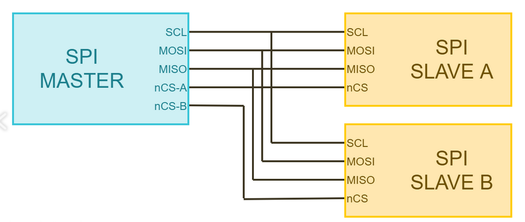
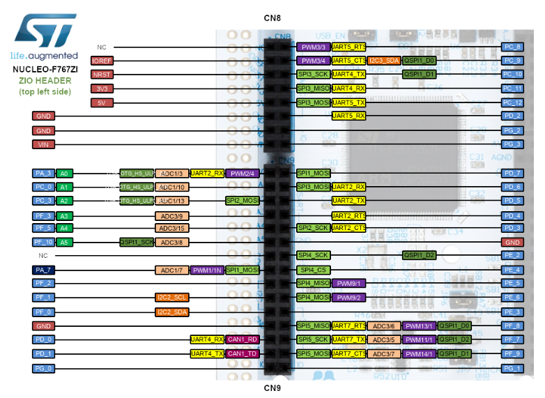
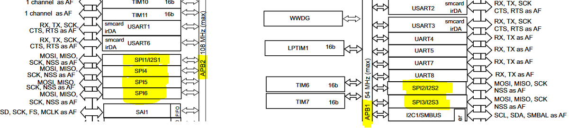

# Инструкция по работе с драйвером SPI

## Что такое SPI?

`SPI (Serial Pripheral Interface)` - высокоскоростной последовательный интерфейс передачи данных, использующий полный дуплекс, то есть возможность передавать информацию в обоих направлениях. 

`STM32` позволяет настраивать аппаратный модуль в режим работы мастера или ведомого с возможностью выбора трёх-проводного или четырёх-проводного подключения. **Однако `ChibiOS` умеет только мастера в четырёхпроводном режиме.**

В общем случае интерфейс состоит из четырёх линий:

* `MISO` - master input slave output
* `MOSI` - master output slave input
* `SCLK` - serial clock
* `CS` - chip select (также может называться slave select)

Интерфейс является синхронным, тактирование происходит на линии `SCLK`, причем, в отличии от `i2c`, где если кто-то не успевает за тактированием, он может задержать передачу данных, здесь тактирование выполняется только мастером. Это может привести к некорректным данным, если выбрать слишком большую частоту.

В случае подключения нескольких ведомых устройств линии `MISO`, `MOSI` и `SCLK` для всех будут общими, а линия `CS` должна быть своя на каждое устройство. Номинально все `CS` находятся в высоком состоянии, 
а перевод в низкое состояние означает начало общения с соответствующим устройством. Линии данных так же могут называться `SDO` - serial data output и `SDI` - serial data input. В этом случае надо понимать, 
что выход ведомого является входом для мастера, и наоборот.

<p align="center">

</p>

Все линии настраиваются в режим работы `PUSHPULL`, соответственно подтягивающие резисторы не нужны, исключение составляет линия `MISO`. Так как для мастера эта нога установлена на вход, если в данный момент не ведётся передача данных с какого-либо устройства, состояние на ноге не определено. В таких случаях подтяжка к земле или питанию желательна, но строго говоря, не обязательна.

Но возвращаемся к нашим драйверам. Чтобы включить драйвер, как и для любого модуля, необходимо в `halconf.h` установить `HAL_USE_SPI` в состояние `TRUE`. А так же в `mcuconfig.h` включить хотя бы один из модулей, 
установив один или несколько `STM32_SPI_USE_SPIx` в состояние `TRUE`, где `x` - номер устройства. Также могут понадобиться дефайны `SPI_USE_WAIT`, `SPI_USE_CIRCULAR`, `SPI_USE_MUTUAL_EXCLUSION` и `SPI_SELECT_MODE`, но о них чуть ниже. Если не понимаешь о чём речь - [смотри сюда](Basics.md).

Все модули работают абсолютно одинаково, поэтому руководствуйтесь исключительно выбором свободой ножки МК. Посмотреть какой модуль на какой ноге можно по [картинке](https://os.mbed.com/platforms/ST-Nucleo-F767ZI/).
**ВАЖНО!! В графической распиновке показаны НЕ ВСЕ функции пинов. БУДЬТЕ ВНИМАТЕЛЬНЫ!!!** 

<p align="center">

</p>

или по [таблице альтернативных функций](https://www.st.com/content/ccc/resource/technical/document/datasheet/group3/c5/37/9c/1d/a6/09/4e/1a/DM00273119/files/DM00273119.pdf/jcr:content/translations/en.DM00273119.pdf#page=89) 
 
> Ссылки даны на информацию по контроллеру STM32F767ZI, обязательно ищите актуальную информацию по своему контроллеру!

## Запуск SPI

Как обычно, запуск осуществляется с помощью функции 

```c
spiStart(&spi_driver, &spi_config);
``` 

Первый аргумент - указатель на драйвер, где имя драйвера `SPIDx`, где `x` - номер того самого подключенного в `mcuconf.h` устройства. Второй аргумент - указатель на структуру конфигурации драйвера.

Может возникнуть желание положить указатель в переменную, чтобы не вспоминать каждый раз про операнд взятия адреса, для этого существует тип `SPIDriver`. Например,
```c
static SPIDriver *spi1 = &SPID1;
```

Тогда запуск `spi` будет такой 
```c
spiStart(spi1, &spi_config);
``` 

## Кофигурация SPI

Структура конфигурации зависит от настройки в `halconf.h` и аппаратной версии драйвера (какая версия на каком контроллере [см. тут](README.md)). На самом деле, от версии почти ничего менятся не будет. 
Для всех версий структура может содержать следующие поля:

```c
typedef struct {
  bool            circular;       // Режим работы
  
  spicallback_t   end_cb;         // Callback функция
  
  ioline_t        ssline;         // Выбор ноги CS
  
  ioportid_t      ssport;         // Снова выбор ноги CS
  ioportmask_t    ssmask;
  
  ioportid_t      ssport;         // Опять выбор ноги CS
  uint_fast8_t    sspad;
  
  uint16_t        cr1;            // Control register 1
  uint16_t        cr2;            // Control register 2
} SPIConfig;
```

Главный вопрос, почему может? Давайте разберём каждую настроку отдельно.

Поле `circular` появляется только если в `halconf.h` определить `SPI_USE_CIRCULAR` в состояние `TRUE`. Как видно поле имеет тип `bool`, а значит мы можем только включить или выключить режим `circular`. Данный режим позволяет непрерывно передавать данные из буфера (как только буфер закончится, данные пойдут на второй круг). Это может быть полезно при работе в асинхронном режиме, при непрерывной передаче большого объёма данных.

Поле `end_cb` есть в структуре всегда. Здесь можно указать функцию, которая будет вызываться при окончании передачи. В `circular` режиме вызов будет просиходить после передачи всего буфера. Если это не нужно, можно написать `NULL`. Аргументом функции должен буть указатель на драйвер, кроме этого она не может ничего принимать и возвращать. То есть выглядеть она может только следующим образом:

```c
void spi_cb_fun(SPIDriver *spip)
{
    (void)spid; \\ Чтобы убрать ворнинг о неиспользуемой переменной
    ...
    do something
    ...
}
```

Дальше идёт выбор ноги для линии `CS`. Способ задания зависит от значения `SPI_SELECT_MODE` в `halconf.h`. Есть пять вариантов:

  - `SPI_SELECT_MODE_NONE` - В этом случае мы не хотим говорить драйверу какую ногу принять за `CS`. Соответственно, в структуре никаких полей по её выбору не будет.
  - `SPI_SELECT_MODE_PAD` - Нога задаётся как `PAD`. В структуре появляются поля `ssport` и `sspad`. Если не понятно, что в этом случае писать, идем читать про [PAL](PAL_setup.md).
  - `SPI_SELECT_MODE_PORT` - Нога задается как `PORT`. В структуре появляются поля `ssport` и `ssmask`. Если не понятно, что в этом случае писать, идем читать про [PAL](PAL_setup.md).
  - `SPI_SELECT_MODE_LINE` - Нога задается как `LINE`. В структуре появляются поле `ssline`. Если не понятно, что в этом случае писать, идём читать про [PAL](PAL_setup.md).
  - `SPI_SELECT_MODE_LLD` - управление ногой отдаётся низкоуровневому драйверу. В этом случае в структуре полей по выбору ноги не будет. Но на STM32F7 это приводит к `"SPI_SELECT_MODE_LLD not supported by this driver"`. Пожимаем плечами и не используем.

Поле `cr1` не является обязательным, но туда может захотеться чего-нибудь написать. В первой и второй версиях оно описывает содержимое `SPI control register 1`, в третьей версии драйвера - `SPI configuration register 1` (**в этом случае поле будет иметь имя cfg1!**). Что лежит в регистре смотрите в [даташите (на свой контроллер!)](https://www.st.com/content/ccc/resource/technical/document/reference_manual/group0/96/8b/0d/ec/16/22/43/71/DM00224583/files/DM00224583.pdf/jcr:content/translations/en.DM00224583.pdf#page=1356).

Для удобства заполнения, есть дефайны, определяющие каждый бит регистра. Так как начальное состояние соответствует всем нулям, наличие этого дефайна означает установку соответствующего бита в единицу.

Например, в первом регистре есть три бита `BR[2:0]`, управляющие частотой передачи. В даташите смотрим, что задаётся прескейлер для `f_PCLK`. Если мы хотим задать частоту интерфейса в 256 раз ниже, чем тактирование шины, в поле `cr1` можно написать `SPI_CR1_BR_2 | SPI_CR1_BR_1 | SPI_CR1_BR_0` в дополнение (через операцию или) к любым другим настройкам. Ну, или можно просто записать битовую маску или десятичное/шестнадцатиричное число, как удобнее.

Поле `cr2` (или `cfg2` для `SPIv3`) соответственно описывает второй регистр. Скорее всего, менять ничего не захочется, но, например, биты `DS[3:0]` позволяют задать размер передаваемого слова (по умолчанию 8 бит).

В итоге, если нам не нужен `circular` режим и в `halconf.h` он выключен, ногу хотим задавать через `LINE` и желаемая частота составляет 6.7МГц, структура будет выглядеть следующим образом.

```c
static SPIConfig conf = {
    .end_cb = NULL, 
    .ssline = PAL_LINE(GPIOA, 4),
    .cr1 = SPI_CR1_BR_1 | SPI_CR1_BR_0,
    .cr2 = SPI_CR2_DS_2 | SPI_CR2_DS_1 | SPI_CR2_DS_0
};
```

Для выбора частоты надо посмотреть на какой шине висит драйвер и узнать частоту этой шины. Посмотреть можно [здесь](https://www.st.com/content/ccc/resource/technical/document/datasheet/group3/c5/37/9c/1d/a6/09/4e/1a/DM00273119/files/DM00273119.pdf/jcr:content/translations/en.DM00273119.pdf#page=20).

На картинке видно, то второй и третий модули висят на `APB1`, остальные на `APB2`. ИХ частота равна частоте процессора деленной на предделитель. Значение предделителей можно посмотреть в `mcuconf.h`, а именно `STM32_PRE1` и `STM32_PRE2`. Для `APB1` минимальное значение предделителя 4 (то есть частота 54МГц), а для `APB2` - 2 (частота 108МГц). 

В моем случае частота шины 108МГц, а значит с предделителем 16, частота интерфейса должна быть 6,75МГц

<p align="center">

</p>

На самом деле, частоту нет необходимости выбирать очень точно. Если читаете регистры датчика, много времени всё равно не сэкономите, но обязательно надо смотреть на максимальную скорость работы датчика. Если превысить частоту, то будут приходить битые данные.

Ну, и как обычно нужно сконфигорурировать ноги в соответствующий режим работы. Казалось бы всё как обычно, смотрим [табличку](https://www.st.com/content/ccc/resource/technical/document/datasheet/group3/c5/37/9c/1d/a6/09/4e/1a/DM00273119/files/DM00273119.pdf/jcr:content/translations/en.DM00273119.pdf#page=89)
и ставим ногам соответствующий режим, но есть нюанс с ногой `CS`. 

Несмотря на то, что в таблице можно найти ногу `SPI1_NSS`, работать она будет не так как мы ожидаем, точнее совсем не будет. Дело в том, что из-за возможного режима ведомого её поведение довольно сложное и уникальное, в связи с этим в `ChibiOS` её работа просто не предусмотрена. Но так как в режиме мастера от неё много не надо, то для корректной работы устанавливаем ей режим работы `PAL_MODE_OUTPUT_PUSHPULL`. Также из-за большой частоты работы интерфейса имеет смысл ногам связанным с `spi` задать высокоскоростной режим работы `PAL_STM32_OSPEED_HIGHEST`.

# Что же этот драйвер умеет?

Функций довольно много, но почти все делают одно и то же. 

Основная фишка заключается в том, что номинально модуль работает в асинхронном режиме. То есть мы можем дать задачу на выполнение и поток пойдет дальше, надо только придумать как понять, что он закончил (например, с помощью callback функции). Таким образом минимальный набор функций следующий:

```c
void spiStart(SPIDriver *spip, const SPIConfig *config);
void spiStop(SPIDriver *spip);
void spiSelect(SPIDriver *spip);
void spiUnselect(SPIDriver *spip);
void spiStartIgnore(SPIDriver *spip, size_t n);
void spiStartExchange(SPIDriver *spip, size_t n,
					const void *txbuf, void *rxbuf);
void spiStartSend(SPIDriver *spip, size_t n, const void *txbuf);
void spiStartReceive(SPIDriver *spip, size_t n, void *rxbuf);
```

Со стартом и стопом наверняка всё и так понятно.

`spiSelect()` и `spiUnselect()` задают низкое или высокое состояние, соответственно, на выбранной в структуре конфигурации ноге `CS`. На вход принимают только указатель на запущенный драйвер. Если там нога не выбрана, то функции не делают ничего. На самом деле это просто переопределение функций `palClearLine()` и `palSetLine()`. Предполагаемая логика работы - сделали `spiSelect()`, пообщались вдоволь, сделали `spiUnselect()`. 

Если устройств несколько, то есть два варианта. Если текущая настройка драйвера второму устройству подходит, то вместо `spiSelect()` и `spiUnselect()` опускайте и поднимайте ногу самостоятельно. Если же конфигурация разная, надо остановить драйвер и запустить заново с другим конфигом. Например:

```c
static SPIConfig dev1 = {
    .end_cb = NULL, 
    .ssline = PAL_LINE(GPIOA, 4),
    .cr1 = SPI_CR1_BR_1 | SPI_CR1_BR_0,
    .cr2 = SPI_CR2_DS_2 | SPI_CR2_DS_1 | SPI_CR2_DS_0
};

\\ Другая нога и помедленнее
static SPIConfig dev2 = {
    .end_cb = NULL, 
    .ssline = PAL_LINE(GPIOA, 3),
    .cr1 = SPI_CR1_BR_2 | SPI_CR1_BR_1 | SPI_CR1_BR_0,
    .cr2 = SPI_CR2_DS_2 | SPI_CR2_DS_1 | SPI_CR2_DS_0
};

int main(void)
{
    ...
	// Поработали с первым устройством
	spiStart(&SPID1, &dev1);
	spiSelect(&SPID1);
	do something
	spiUnselect(&SPID1);
	spiStop(&SPID1);
	// Поработали со вторым устройством
	spiStart(&SPID1, &dev2);
	spiSelect(&SPID1);
	do something
	spiUnselect(&SPID1);
	spiStop(&SPID1);
    ...
}	
```

Здесь API работает не слишком изящно, поэтому не стесняйтесь от него отходить, если понимаете что делаете.

`spiStartExchange()` это основная функция для работы драйвера в асинхронном режиме. Предполагает передачу данных в обоих направлениях. Аргументами являются указатель на запущенный драйвер, количество слов для передачи, указатель на буфер для передачи и указатель на буфер для принимаемых данных. Хитрость здесь в том, что по `spi` данные всегда идут в обоих направлениях. Если мы пишем, значит мы ещё и читаем.

`spiStartIgnore()` позволяет проигнорировать `n` слов. Например, если нас не интересуют данные, которые нам сейчас отправляют и мы не хотим ничего писать, но останавливать обещние не надо. Аругменты - указатель на запущенный драйвер и количество игнорируемых слов.

Для удобства использования, есть пара функций `spiStartSend()` и `spiStartReceive()`. На самом деле это всё тот же `spiStartExchange()`, но без одного из буферов в аргументах. То есть в первом случае прочитанные данные никуда не сохраняются, а во втором случае пишутся только единицы. Неочевидной особенностью может являться то, что если мы хотим сначала записать данные с помощью `spiStartSend()`, а потом прочитать с помощью `spiStartReceive()`, то настроенное прерывание (если есть) на окончание передачи сработает дважды, в то время как с использованием `spiStartExchange()` оно сработает единожды, но придётся заморочится с обработкой буферов.

Если используется режим работы `circular`, появляется ещё пара функций

```c
void spiAbortI(SPIDriver *spip);
void spiAbort(SPIDriver *spip);
```

Как понятно из названия, они останавливают передачу, причём первая может работать из прерываний. То есть, например, по окончанию передачи буфера можно в `callback` функции выключить передачу.

Если асинхронный режим работы не нужен и не нравится, то можно включить синхронный. Для этого устанавливаем `SPI_USE_WAIT` из `halconf.h` в состояние `TRUE`. Это даст нам ещё несколько функций:

```c
void spiIgnore(SPIDriver *spip, size_t n);
void spiExchange(SPIDriver *spip, size_t n, const void *txbuf, void *rxbuf);
void spiSend(SPIDriver *spip, size_t n, const void *txbuf);
void spiReceive(SPIDriver *spip, size_t n, void *rxbuf);
```

Как видно, у них такие же имена как у асинхронных, но без слова старт. Делают они точно то же самое, но поток ждёт их выполнения, таким образом на следующей строчке мы уверены, что передача завершена.

При работе с одним и тем же драйвером из разных потоков можно случайно всё сломать. Чтобы этого избежать, в `halconf.h` ставим `SPI_USE_MUTUAL_EXCLUSION` в состояние `TRUE`. Это даст доступ ещё к паре функций:

```c
void spiAcquireBus(SPIDriver *spip);
void spiReleaseBus(SPIDriver *spip);
```

Перед началом работы с драйвером вызываем `spiAcquireBus()`, а после окончания работы отпускаем его с помощью `spiReleaseBus`. Если при обращению к драйверу он окажется занят, поток встанет в очередь и будет ждать. Аргументом функций является указатель на драйвер.

## Важное замечание!

Сам не пробовал, но драйвер не должен работать в прерываниях (например по таймеру), кроме функций I-класса, в данном случае это только `spiAbortI()`. Если всё же попробовать, вероятнее всего контроллер зависнет.

Также `spi` не может работать одновременно с `i2c`. Если это всё-таки необходимо, перед тем как выполнить `i2cStart()`, остановите `spi` с помощью `spiStop()`.

## Ну и, наконец, пример

Чтение данных с гироскопа `L3GD20H` с помощью `spi` в синхронном режиме.
Код для платы `NUCLEO-F767ZI`.

```c
#include "ch.h"
#include "hal.h"
#include <chprintf.h>
\\ Настройка вывода информации в терминал с помощью format string
static const SerialConfig sd_st_cfg = {
  .speed = 115200,
  .cr1 = 0, .cr2 = 0, .cr3 = 0
};

static SerialDriver         *debug_serial = &SD3;
static BaseSequentialStream *debug_stream = NULL;

void debug_stream_init( void )
{
    sdStart( debug_serial, &sd_st_cfg );
    palSetPadMode( GPIOD, 8, PAL_MODE_ALTERNATE(7) );
    palSetPadMode( GPIOD, 9, PAL_MODE_ALTERNATE(7) );

    debug_stream = (BaseSequentialStream *)debug_serial;
}

void dbgprintf( const char* format, ... )
{
    if ( !debug_stream )
        return;

    va_list ap;
    va_start(ap, format);
    chvprintf(debug_stream, format, ap);
    va_end(ap);
}

\\ Положим указатель на драйвер в переменную
SPIDriver* spi1 = &SPID1;

\\ Структура конфигурации, circular режим выключен в halconf.h, CS задается как PAL_LINE
static SPIConfig conf = {
    \\ Не используем прерывания
    .end_cb = NULL,
    \\ CS вешаем на ногу А4
    .ssline = PAL_LINE(GPIOA, 4),
	\\ Значение предделителя 16
    .cr1 = SPI_CR1_BR_1 | SPI_CR1_BR_0,
	\\ Длина слова 8 бит
    .cr2 = SPI_CR2_DS_2 | SPI_CR2_DS_1 | SPI_CR2_DS_0
};

int main(void) {

	\\ Включаем Чиби
    halInit();
    chSysInit();
	
	\\ Включаем UART
	debug_stream_init();
	
    \\ Запускаем драйвер
    spiStart(spi1, &conf);
	
	\\ Настраиваем ноги. MISO, MOSI, SCLK в альтернативный режим согласно даташиту, CS просто на выход PUSHPULL
    palSetLineMode(PAL_LINE(GPIOA, 4), PAL_MODE_OUTPUT_PUSHPULL);
    palSetLineMode(PAL_LINE(GPIOA, 5), PAL_MODE_ALTERNATE(5) | PAL_STM32_OSPEED_HIGHEST);
    palSetLineMode(PAL_LINE(GPIOA, 6), PAL_MODE_ALTERNATE(5) | PAL_STM32_OSPEED_HIGHEST);
    palSetLineMode(PAL_LINE(GPIOA, 7), PAL_MODE_ALTERNATE(5) | PAL_STM32_OSPEED_HIGHEST);
	
	\\ инициализируем буферы
    uint8_t txbuf[5] = {0x60, 0x0F, 0x00, 0x01, 0x30};
    uint8_t rxbuf[6] = {0};
    uint8_t data_reg[1] = {0b11101000};

	\\ Инициализируем датчик
	\\ Опустили ногу
    spiSelect(spi1);
	\\ Отправляем данные (сначала адрес регистра с автоинкрементированием, потом заполняем 4 ригистра конфигурации)
    spiSend(spi1, 5, txbuf);
	\\ Отпускаем ногу
    spiUnselect(spi1);
	
    while (true) {
		\\ С частотой 10 Герц читаем дачтик
        chThdSleepMilliseconds(100);
		\\ Опускаем ногу
        spiSelect(spi1);
		\\ Отправлем адрес регистра данных с автоинкреминтированием
        spiSend(spi1, 1, data_reg);
		\\ Читаем 6 байт
        spiReceive(spi1, 6, rxbuf);
		\\ Отпускаем ногу
        spiUnselect(spi1);
		\\ Обрабатываем информацию и отправляем на терминал
        uint8_t i;
        int16_t* temp = (int16_t*)rxbuf;
        float buf[3] = {0, 0, 0};
        for(i = 0; i < 3; i++){
            buf[i] = (float)temp[i] * 0.07f;
        }
        dbgprintf("x %.2f, y %.2f, z %.2f\r\n", buf[0], buf[1], buf[2]);
    }
}
```
