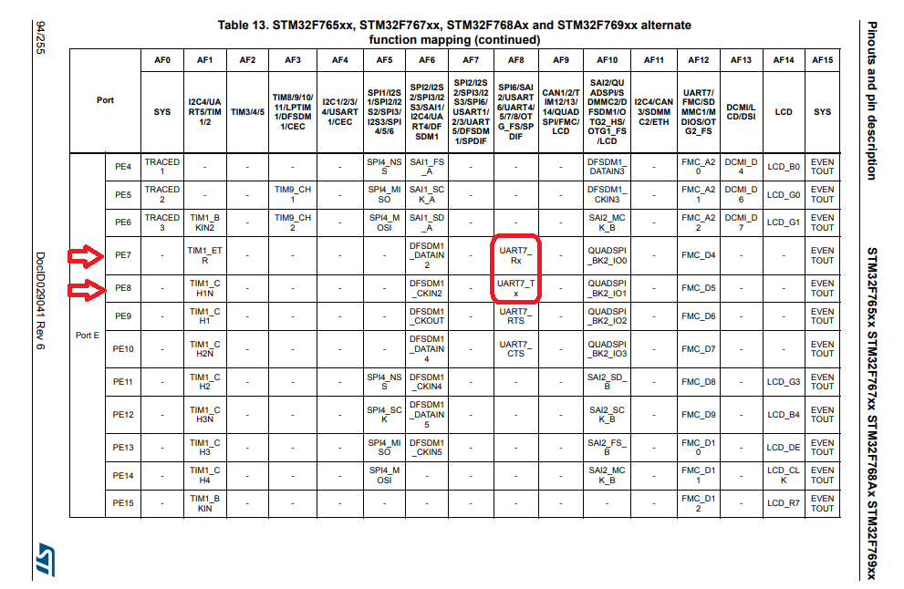
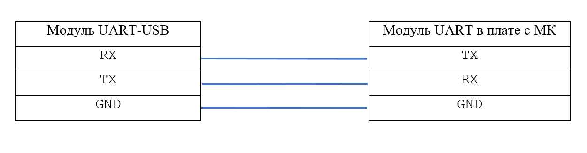

# Как завести Serial Driver на STM-ке

## Первый шаг - выбор модуля Serial Driver 

Serial является обёрткой над UART, что предоставляет удобный функционал по сравнению с необходимостью работать с прерываниями. Поэтому в дальнейшем при работе с STM и ChibiOS под UART будем понимать Serial Driver

Стандартная процедура по выявлению свободных модулей и пинов микроконтроллера (МК). 

> Предположим, что модуль Serial Driver №7 нам всем подходит. В дальнейшем весь код будет связан именно с этим модулем. 

## Второй шаг - определение пинов

1. Открыть Datasheet (DS) на странице с [F767ZI Alternate functions](http://www.st.com/content/ccc/resource/technical/document/datasheet/group3/c5/37/9c/1d/a6/09/4e/1a/DM00273119/files/DM00273119.pdf/jcr:content/translations/en.DM00273119.pdf#page=89) и найти пины, в фукнциях которых обозначена их принадлежность к одному из модулей Serial Driver (в нашем случае к UART7)

> Не забывайте, что вам понадобятся 2 пина: RX (*Receive* - для приёма данных) и TX (*Transmit* - для передачи данных)

<p align="center">

</p>
 
 2. Открыть страницу с [графической распиновкой платы](https://os.mbed.com/platforms/ST-Nucleo-F767ZI/) и найти пины, принадлежащие к таймеру №Х. **ВАЖНО!! В графической распиновке показаны НЕ ВСЕ функции пинов. БУДЬТЕ ВНИМАТЕЛЬНЫ!!!** 

<p align="center">

</p>

> Важно помнить, что когда вы подключаете физический модуль Serial Driver-USB к плате с МК, то ножки Serial Driver-USB и МК должны быть соединены RX - TX, соответственно. 

<p align="center">

</p>

## Третий шаг - Познакомим STM-ку с Serial Driver

Нужно дать понять МК, что мы хотим использовать Serial Driver, и что мы хотим использовать модуль Serial Driver №Х. Как это сделать - написано в [основах работы с модулями](Basics.md) :grin:.

## Четвёртый шаг - Настройка Serial Driver

Теперь STM морально подготовлена к работе с Serial Driver. Пора указать как именно должен работать протокол передачи данных.

```cpp
static const SerialConfig sdcfg = {
    .speed  = 9600,
    .cr1    = 0,
    .cr2    = 0,
    .cr3    = 0
};

```
В этой структуре происходит основная настройка Serial Driver 

* `sdcfg` - название структуры (аналогично с названием стандартных переменных)
* `speed` - скорость передачи данных [частота передачи ~ [боды](https://en.wikipedia.org/wiki/Baud)]
  Боды могут быть заданы как вручную (любое число), так и выбраны из стандартного ряда:
  9600,
  19200,
  38400,
  57600,
  115200,
  ...
* `cr1`, `cr2`, `cr3` - настройка режимов работы, с помощью них могут быть заданы настройки передачи (количество стоп-бит, режим LIN и другие) напрямую в регистры (они так и называются `CR1`, `CR2`, `CR3`)  
  Для начала работы достаточно оставить параметры нулями, так как это настроит Serial на режим по-умолчанию (8 data bits, no parity, 1 stop bit = 8N1)

> Для просмотра возможных значений для регистров обращаться по `$CHIBIOS_ROOT/os/common/ext/CMSIS/ST/STM32F7xx/stm32f767xx.h` (или в папку с соответствующей моделью) и искать макросы USART_CR(1,2,3)_*

> Также в любой непонятной ситуации можно пощупать [Reference manual (RM)](http://www.st.com/content/ccc/resource/technical/document/reference_manual/group0/96/8b/0d/ec/16/22/43/71/DM00224583/files/DM00224583.pdf/jcr:content/translations/en.DM00224583.pdf)

```cpp
int main(void)
{
    chSysInit();
    halInit();

    sdStart( &SD7, &sdcfg );
    palSetPadMode( GPIOE, 8, PAL_MODE_ALTERNATE(8) );    // TX
    palSetPadMode( GPIOE, 7, PAL_MODE_ALTERNATE(8) );    // RX

    while (true)
    {
        sdWrite(&SD7, "Hohoho\r\n", 8);
        chThdSleepSeconds( 1 );
    }
}
```
* `sdStart( &SD7, &sdcfg );` - запуск модуля №7 с именем `sdcfg`  
* `palSetPadMode( GPIOE, 8, PAL_MODE_ALTERNATE(8) );` - настройка пина PE8 на работу с Serial Driver (TX) (номер функции берётся из [Datasheet](http://www.st.com/content/ccc/resource/technical/document/datasheet/group3/c5/37/9c/1d/a6/09/4e/1a/DM00273119/files/DM00273119.pdf/jcr:content/translations/en.DM00273119.pdf#page=89)). Аналогично с пином PE7 (RX). 

В цикле будет не очень неистово спамится строка `Hohoho` (с задержкой в 1 с) =)

## Пятый шаг - Использование Serial Driver

Для начала пройдемся по функциям из [доков](http://chibios.sourceforge.net/docs3/hal/group___s_e_r_i_a_l.html):  

Функция (прототипы)     | Описание
------------------------|------------------------
`sdPut(sdp, b)`         | отправить байт `b` по драйверу `sdp`
`sdGet(sdp)`            | получить байт по драйверу `sdp`, байт находится в возвращаемом значении
`sdRead(sdp, b, n)`     | получить `n` байт из драйвера `sdp` и записать в буфер `b`, возвращает число прочитанных байт
`sdWrite(sdp, b, n)`    | отправить `n` байт по драйверу `sdp` из буффера `b`, возвращает число отправленных байт

Все указанные функции являются блокирующими и зависают до конца выполнения операции.

Примеры вызовов:
```cpp
    sdPut(&SD2, 'a');
    char token = sdGet(&SD1);
    sdWrite(&SD6, "Hohoho\r\n", 8);
    sdRead(&SD3, buffer, 5);
```

Рассмотрим аналог функции printf() из стандартной бибилиотеки С:
```cpp
/**
 * @brief   System formatted output function.
 * @details This function implements a minimal @p printf() like functionality
 *          with output on a @p BaseSequentialStream.
 *          The general parameters format is: %[-][width|*][.precision|*][l|L]p.
 *          The following parameter types (p) are supported:
 *          - <b>x</b> hexadecimal integer.
 *          - <b>X</b> hexadecimal long.
 *          - <b>o</b> octal integer.
 *          - <b>O</b> octal long.
 *          - <b>d</b> decimal signed integer.
 *          - <b>D</b> decimal signed long.
 *          - <b>u</b> decimal unsigned integer.
 *          - <b>U</b> decimal unsigned long.
 *          - <b>c</b> character.
 *          - <b>s</b> string.
 *          .
 *
 * @param[in] chp       pointer to a @p BaseSequentialStream implementing object
 * @param[in] fmt       formatting string
 * @return              The number of bytes that would have been
 *                      written to @p chp if no stream error occurs
 *
 * @api
 */
int chprintf(BaseSequentialStream *chp, const char *fmt, ...)
```

Для включения функции необходимо в `Makefile` добавить строку включения компиляции связанных с данной функций модулей (уже сделано в шаблоне):
```
include $(CHIBIOS)/os/hal/lib/streams/streams.mk
```
а также подключить заголовочный файл `chprintf.h`:
```cpp
#include <chprintf.h>
```

Принцип данной функции в том, чтобы сформировать строку и вывести ее на Serial интерфейс (см. [formatting string - printf()](https://ru.wikipedia.org/wiki/Printf)), пример вызова:

```cpp
chprintf(((BaseSequentialStream *)&SD7), "Hello, volks %d!\n\r", 777);
```

> В качестве проверки работоспособности, можно повыводить в локальный терминал строки и числа. А для дальнейшнего развития можно связать МК с матлабом и поперекидывать данные в обе стороны. Как это сделать? - Гугл в помощь :grin: Успехов!

## Ссылки =)

[Туториал на playembedded по Serial](http://www.playembedded.org/blog/stm32-usart-chibios-serial/)
