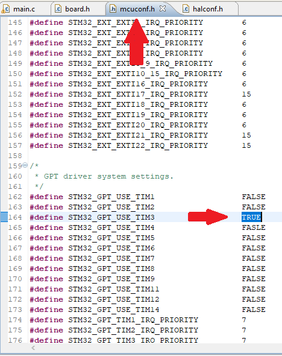

# Заводим таймер на STM-ке

Все таймеры важны, все таймеры нужны. 

Сначала, нужно определиться какой таймер свободен. 

> Для примера возьмём таймер №3 

## Первый шаг - Познакомим STM-ку с таймером

Нужно дать понять микроконтроллеру (МК), что мы хотим использовать таймер №Х. Для этого нужно сделать 2 действия:

1. В файле `mcuconf.h` (он разположен в папке проекта - удобно открывать через Eclipse) найти секцию, посвящённую настройкам таймера (GPT) и присвоить значение `TRUE` нужному таймеру.

<p align="center">

</p>

> Можно одновременно использовать несколько таймеров, конечно же :muscle:

**СОХРАНИТЕ ВСЕ ИЗМЕНЕНИЯ В ФАЙЛАХ, по умолчанию ничего не сохраняется!**

2.  В файле `halconf.h` (он расположен в папке проекта - удобно открывать через Eclipse) найти секцию, посвящённую таймерам и присвоить значение `TRUE` - тем самым разрешая работу всех таймеров (которые вы выбрали в предыдущем пункте 1).

<p align="center">

</p>

> Если до этого вы уже где-то использовали таймеры, то там уже должно стоять значение `TRUE`

**СОХРАНИТЕ ВСЕ ИЗМЕНЕНИЯ В ФАЙЛАХ, по умолчанию ничего не сохраняется!**

## Второй шаг - Настройка конфигурации таймера 

Когда глобальные настройки сделаны, нужно в файле main.c прописать настройку конфигурации таймера 

```cpp
GPTConfig gpt3conf = {
    .frequency    = 10000,
    .callback     = NULL,
    .cr2          = 0,
    .dier         = 0
};
```

* `.frequency` - частота работы таймера в системных тиках 

* `.callback` - это функция, которая будет вызвана когда таймер дасчитает до верхнего предела (либо переполнится). Значение `NULL` означает, что никакая функция не будет вызываться

* `.cr2` и `.dier` - регистры таймера, для работы достаточно значений по умолчанию 0, подробнее - обнимайтесь с [Reference manual (RM)](http://www.st.com/content/ccc/resource/technical/document/reference_manual/group0/96/8b/0d/ec/16/22/43/71/DM00224583/files/DM00224583.pdf/jcr:content/translations/en.DM00224583.pdf) 

В функции `main()` происходит инициализация таймера и его запуск. 

```cpp
int main(void)
{
	chSysInit();
  	halInit();

  	GPTDriver *delayDriver    = &GPTD3;

	gptStart( delayDriver, &gpt3conf );

	while (true)
	{
		gptPolledDelay( delayDriver, gpt3conf.frequency/2 );
	}
}
```
* `gptPolledDelay( delayDriver, gpt3conf.frequency/2 );` - данная функция осуществляет задержку (в этот момент все системы спят). **Не рекомендуется использовать в больших программах**. Выражение `gpt3conf.frequency/2` имеет значение `5000`, что является тиками таймера, который мы настраиваем. Функция `gptPolledDelay()` останавливает выполнение кода до тех пор, пока таймер не насчитаем указанные количество тиков. Значение `5000` взято из расчёта, что мы хотим получить задержку в 500 мс: `10000/2=5000 - тиков таймера. 500 [мс] = 0,5 [с] = 1/2 [c] = x/frequency = x/10000` => `x = 5000`.  

**!!!!** Не забывайте, что таймеры бывают разные (16-битные, 32-битные в стм-ке в частности). Посмотреть кто из них кто можно в [табличке из DS](https://www.st.com/content/ccc/resource/technical/document/datasheet/group3/c5/37/9c/1d/a6/09/4e/1a/DM00273119/files/DM00273119.pdf/jcr:content/translations/en.DM00273119.pdf#page=38) 
* 16-битный таймера -> max = 2^16-1 
* 32-битный таймер -> max = 2^32-1

Чтобы проверить работоспособность настроек, можно написать программу по пиганию светодиода с использованием функции `palSetLine(LINE_LED1);` Удачи! 
