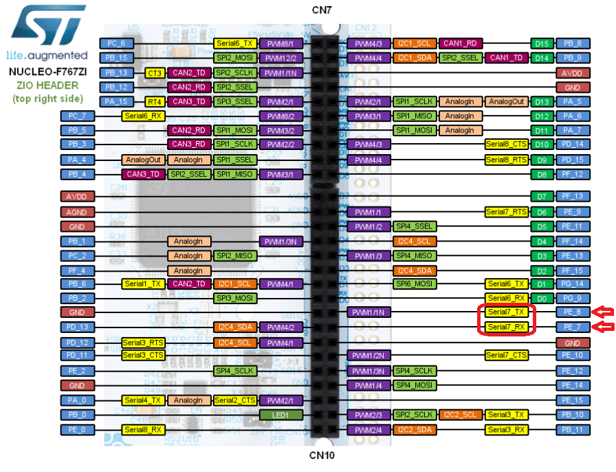
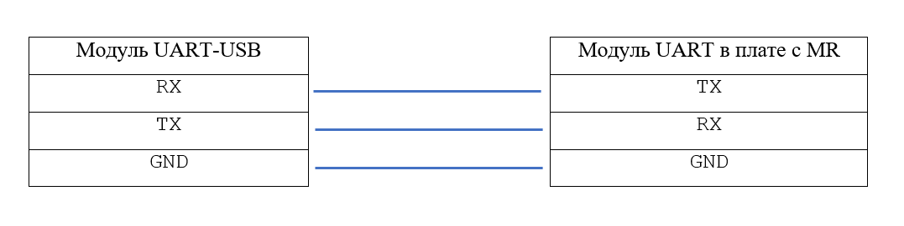

# Как завести UART на STM-ке

## Первый шаг - выбор модуля UART 

Стандартная процедура по выявлению свободных модулей и пинов микроконтроллера (МК). 

> Предположим, что модуль Serial №7 нам всем подходит. В дальнейшем весь код будет связан именно с этим модулем. 

## Второй шаг - определение пинов

1. Открыть Datasheet (DS) на странице с [F767ZI Alternate functions](http://www.st.com/content/ccc/resource/technical/document/datasheet/group3/c5/37/9c/1d/a6/09/4e/1a/DM00273119/files/DM00273119.pdf/jcr:content/translations/en.DM00273119.pdf#page=89) и найти пины, в фукнциях которых обозначена их принадлежность к одному из модулей UART (в нашем случае к UART7)

> Не забывайте, что вам понадобятся 2 пина: RX (*Receive* - для приёма данных) и TX (*Transmit* - для передачи данных)

<p align="center">

</p>
 
 2. Открыть страницу с [графической распиновкой платы](https://os.mbed.com/platforms/ST-Nucleo-F767ZI/) и найти пины, принадлежащие к таймеру №Х. **ВАЖНО!! В графической распиновке показаны НЕ ВСЕ функции пинов. БУДЬТЕ ВНИМАТЕЛЬНЫ!!!** 

<p align="center">

</p>

> Важно помнить, что когда вы подключаете физический модуль UART-USB к плате с МК, то ножки UART-USB и МК должны быть соединены RX - TX, соответственно. 

<p align="center">

</p>

## Третий шаг - Познакомим STM-ку с UART

Нужно дать понять МК, что мы хотим использовать UART (Serial), и что мы хотим использовать модуль UART №Х. Как это сделать - написано в [основах работы с модулями](Basics.md) :grin:.

## Четвёртый шаг - Настройка UART

Теперь STM морально подготовлена к работе с UART. Пора указать как именно должен работать протокол передачи данных.

```cpp
static const SerialConfig sdcfg = {
  .speed = 460800,  // speed in ticks 
  .cr1 = 0,
  .cr2 = USART_CR2_LINEN,
  /* Just to make it more powerful =), RM says that it enables error detection,
  so this should work without this USART_CR2_LINEN */
  .cr3 = 0
};

```
В этой структуре происходит основная настройка UART 

* `sdcfg` - имя модуля, название переменной структуры (аналогично с названием стандартных переменных)
* `.speed` - скорость передачи данных [тики]

> Также в любой непонятной ситуации можно пощупать [Reference manual (RM)](http://www.st.com/content/ccc/resource/technical/document/reference_manual/group0/96/8b/0d/ec/16/22/43/71/DM00224583/files/DM00224583.pdf/jcr:content/translations/en.DM00224583.pdf)

```cpp
int main(void)
{
    chSysInit();
    halInit();

    sdStart( &SD7, &sdcfg );
    palSetPadMode( GPIOE, 8, PAL_MODE_ALTERNATE(8) );    // TX
    palSetPadMode( GPIOE, 7, PAL_MODE_ALTERNATE(8) );    // RX

     while (true){
     	 chprintf(((BaseSequentialStream *)&SD7), "Hello, volks!\n\r");
     }
```
* `sdStart( &SD7, &sdcfg );` - запуск модуля №7 с именем `sdcfg`
* `palSetPadMode( GPIOE, 8, PAL_MODE_ALTERNATE(8) );` - настройка пина PE8 на работу с UART (TX) (номер функции берётся из [Datasheet](http://www.st.com/content/ccc/resource/technical/document/datasheet/group3/c5/37/9c/1d/a6/09/4e/1a/DM00273119/files/DM00273119.pdf/jcr:content/translations/en.DM00273119.pdf#page=89)). Аналогично с пином PE7 (RX). 

В цикле будет неистово спамится фраза `Hello, volks!` с использованием стандартной функции `chprintf()`

> В качестве проверки работоспособности, можно повыводить в локальный терминал строки и числа. А для дальнейшнего развития можно связать МК с матлабом и поперекидывать данные в обе стороны. Как это сделать? - Гугл в помощь :grin: Успехов!

