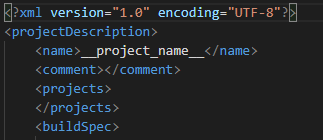
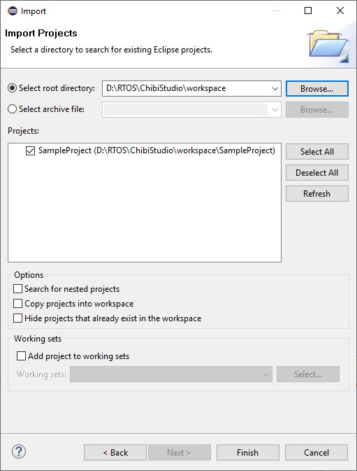
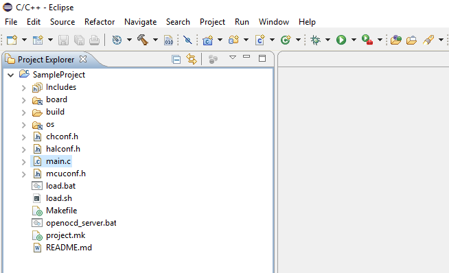
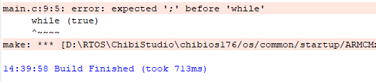
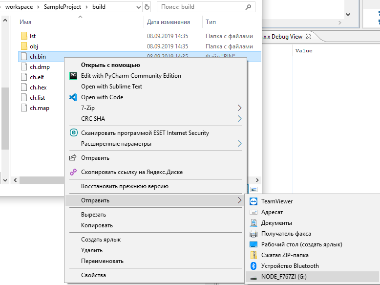

# Настройка нового проекта под ChibiOS.

Проекты для ChibiOS разрабатывались с использованием открытого исходного кода, поэтому проект базируется на системе сборки `Make`. В Eclipse пока нет плагина, который позволяет нам привычно нажать кнопки `New - Project ...` Для этого шаблоны проектов есть в:
- архиве ChibiStudio в папке `templates`, 
- в репозитории по [адресу](https://github.com/KaiL4eK/STM32_ChibiOS/tree/stable_17.6.x/ProjectTemplates), там находятся наиболее актуальные версии шаблонов проектов.

Из одного из представленных мест достаем папку с наименованием платы, с которой планируется работать, и кладем в папку `workspace` ChibiStudio.

# Содержание шаблона

Пройдемся по основным файлам:

- файл **Makefile** - файл, который используется для сборки проекта (он был написан разработчиками ChibiOS), [KaiL4eK](https://github.com/KaiL4eK) же внёс некоторые изменения;
- файл **project.mk** - сокращенное представление `Makefile`, в котором производится настройка проекта (об этом здесь отдельная глава);
- файл **load.sh/load.bat** - скрипт для загрузки проекта непосредственно в плату STM для системы Linux/Windows;
- файл **main.c** - основной файл, в котором пишется код;
- файлы **cfg/[mcu/hal/ch]conf.h** - конфигурация ChibiOS;
- файл **openocd_server.bat** - скрипт запуска сервера отладки через OpenOCD.

# Название проекта

Переименовываем проект:
- переименовать саму папку (допустим название будет `SampleProject`),
- поменять имя проекта (на него смотрим Eclipse) в файле `.project` в месте `<name>__project_name__</name>` c такого вида:

<p align="center">

</p>

На новое название:

<p align="center">

</p>

# Импорт проекта в ChibiStudio (Eclipse)

В результате у вас есть папка с новым проектом, можете импортировать в Eclipse или работать в удобной для вас IDE.

Для импорта делаем следующее:
1. File -> Import -> General -> Existing Projects into Workspace -> **Next**

<p align="center">

</p>

2. Указать путь, где лежит проект Select root directory: -> Browse...  -> **Finish**

<p align="center">

</p>

<p align="center">

</p>

Импорт проекта закончен :dancers: 

# Настройка проекта

Здесь подробнее поговорим о настройке через файл `project.mk`:
```Makefile
# C source files
PROJECT_CSRC 	= main.c
# C++ source files
PROJECT_CPPSRC 	= 
# Directories to search headers in
PROJECT_INCDIR	= 
# Additional libraries
PROJECT_LIBS	=
# Compiler options
PROJECT_OPT     =
```

Написан данный файл с использования синтаксиса `Makefile`. Разберем основные переменные, которые используются в сборке:
### PROJECT_CSRC

Переменная указания путей до исходников (файлов исходных кодов) на языке С для проекта. Исходники имеют расширения `*.c`.  

> Если вы добавляете в проект файлы исходников, сразу прописывайте сюда, иначе характерными ошибками будут `undefined function ...`

### PROJECT_CPPSRC

Переменная указания путей до исходников (файлов исходных кодов) на языке С++ для проекта. Исходники имеют расширения `*.cpp`, `*.cc`.

> Если вы добавляете в проект файлы исходников, сразу прописывайте сюда, иначе характерными ошибками будут `undefined function ...`

### PROJECT_INCDIR

Данная переменная должна указывать на пути до директорий с заголовочными файлами.

> Если вы создали новую папку с заголовочными файлами или хотите подключить из другого места, прописывайте сюда. Характерные ошибки - не найден заголовочный файл

### PROJECT_LIBS

В данной переменной перечисляются опции, которые передаются линковщику `ld`. Опции могут указывать как используемые библиотеки через `-l`, так и пути для поиска файлов библиотек через `-L`.

<details>
<summary>Немного о библиотеках</summary>

*Допустим* нам инетерсна библиотека под названием `features`. Она лежит в директории `D:\libs`. Она может быть представлена как статическая библиотека `libfeatures.a` (`libfeatures.lib`), так и динамическая `libfeatures.so` (`libfeatures.dll`). Для ее подключения мы прописываем опции `-L D:\libs` и `-lfeatures`.

Системные библиотеки могут быть подключены без указания пути, необходимо лишь указать требуемую библиотеку. Например, для библиотеки математики `libm.a` опция подключения будет `-lm`.
</details>

> Для данной опции характерны ошибки `undefined function`, но из библиотеки, которую вы пытаетесь использовать

### PROJECT_OPT

Данная переменная должна содержать опции, которые будут переданы на этап компиляции.

> На начале работы данную переменную не требуется применять, но некоторые ошибки, связанные с компилятором с помощью нее можно поправить в конкретных ситуациях.

Примером рабочего `project.mk` можно рассмотреть следующий пример:
```Makefile
ROSLIB = ./ros_lib
include $(ROSLIB)/ros.mk

PROJECT_MODULES = src/lld_control.c        			\
				  src/remote_control.c				\
				  src/lld_encoder.c					\
				  src/lld_odometry.c				\
				  src/lld_steer_angle_fb.c			\
				  src/drive_cs.c					\
				  src/lld_start_button.c			\
				  src/main_control_unit.c			\
				  src/lld_light.c 					\
				  src/max7219.c 					\
				  
PROJECT_TESTS   = tests/test_lld_control.c     		\
				  tests/test_remote_control.c		\
				  tests/test_drive_cs.c				\
				  tests/test_lld_encoder.c			\
				  tests/test_lld_odometry.c			\
				  tests/test_lld_steer_angle_fb.c	\
				  tests/test_ros.c					\
				  tests/test_gui_server.c			\
				  tests/test_ros_odometry.c			\
				  tests/test_ros_control.c			\
				  tests/test_lld_start_button.c		\
				  tests/test_system_timer.c			\
				  tests/test_lld_light.c 			\
				  		
PROJECT_CSRC    = src/main.c src/common.c src/debug.c src/usbcfg.c \
    				$(PROJECT_MODULES) $(PROJECT_TESTS)

PROJECT_CPPSRC 	= $(ROSSRC) src/ros.cpp

PROJECT_INCDIR	= include tests $(ROSINC)

PROJECT_LIBS	= -lm

PROJECT_OPT	= -specs=nosys.specs
```

Во всех переменных, которых указываются пути, могут использоваться относительные пути от корня проекта.

# Сборка проекта

Для сборки проекта используется иконка "молотка" на панели инструментов ChibiStudio:
<p align="center">

</p>

Альтернативный способ сборки: Правый клик по проекту -> **Build Project**
<p align="center">

</p>

В результате сборки в консоли должна появиться надпись `Build Finished`:
<p align="center">

</p>

В случае наличия ошибок данная надпись также появится, но уже с указанием мест и симптомов ошибок:
<p align="center">

</p>

# Загрузка на контроллер

На данный момент есть два способа загрузки скомпилированной программы в контроллер:

- Использовать `load.bat / load.sh` (в зависимости от вашей системы). 2 раза щёлкнули по скрипту **из среды ChibiStudio**, на плате должен замигать сигнальный диодик (он меняет цвет с зелёного на оранжевый и обратно). Программа загружена.

> Не самый очевидный способ, но зато самый простой 

- Открыть проводник -> наш проект -> папка `build` -> файл `.bin` и отправим его на флэшку (плату): Правый клик -> Отправить -> **NODE_F767ZI** (или может другой контроллер).

<p align="center">

</p>

# P.S.

- Не забывайте сохранять код после написания (комбинация `Ctrl+S`)!
