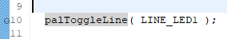
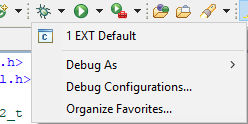
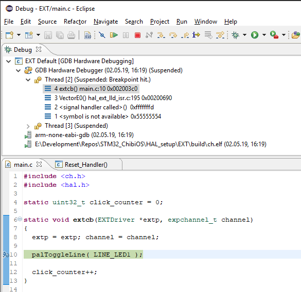
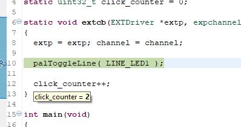
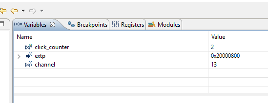
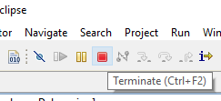
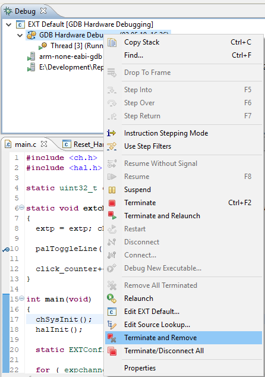

# Отладка кода на контроллере STM32F7x с использованием Eclipse в качестве IDE

Процесс отладки на конроллере STM32 происходит по принципу удаленной отладки, что означает, что существует сервер, который подключается к контроллеру, и клиент, которым в нашем случае является утилита `arm-none-eabi-gdb` - стандартный GDB отладчик из набора GNU инструментов. Клиент посылает стандартные для отладки команды, а сервер, получая их, преобразует в соответствующие команды контроллера.

## Код для примера

Все действия будут описаны на примере данного кода:
```c++
#include <ch.h>
#include <hal.h>

static uint32_t click_counter = 0;

static void extcb(EXTDriver *extp, expchannel_t channel) 
{
  extp = extp; channel = channel;

  palToggleLine( LINE_LED1 );

  click_counter++;
}

int main(void)
{
  chSysInit();
  halInit();

  static EXTConfig extcfg;

  for ( expchannel_t ch = 0; ch < EXT_MAX_CHANNELS; ch++ )
  {
    extcfg.channels[ch].mode  = EXT_CH_MODE_DISABLED;
    extcfg.channels[ch].cb    = NULL;
  }

  extStart( &EXTD1, &extcfg );

  EXTChannelConfig ch_conf;
  ch_conf.mode 	= EXT_CH_MODE_FALLING_EDGE | EXT_CH_MODE_AUTOSTART | EXT_MODE_GPIOC;
  ch_conf.cb	= extcb;

  extSetChannelMode( &EXTD1, 13, &ch_conf );

  while (true)
  {
    chThdSleepMilliseconds( 100 );
  }
}
```

Он простенький - по кнопке считаем нажатия. Да, в примере не учитывается дребезг кнопки, но он нам даже на пользу может сработать, почему - узнаете.

## Запуск сервера отладки 

Запуск сервера производится при подключенном контроллере.

### Windows

Здесь все просто, из среды Eclipse запустите скрипт, который в настоящее время есть во всех шаблонах проектов - `openocd_debug.bat`.

### Linux

> TODO - Нужна проверка работоспособности

Для работы нужна утилита `openocd`, которая как раз кстати стоит в готовом пакете. Запуск сервера производится командой:
```bash
openocd -s "$CHIBISTUDIO/tools/openocd/scripts" -f board/st_nucleo_f7.cfg -c "stm32f7x.cpu configure -rtos auto;"
```

Для обоих ОС этого достаточно, чтобы запустить сервер отладки. 

## Настройка среды Eclipse

Для отладки используется расширение Eclipse под названием `GDB Hardware Debugging` - оно уже установлено в подготовленной среде. Запускаем `Debug Condigurations...` и создаем конфигурация `GDB Hardware Debugging`.

<p align="center">

</p>

Настраиваем в соответствии с настройками:

<p align="center">

</p>

Указали бинарный файл для работы с ним `ch.elf`, остальное - по-умолчанию.

<p align="center">

</p>

Указали утилиту GDB для нашей платформы и порт сервера, остальное - по-умолчанию.

<p align="center">

</p>

Не хотите прошивать контроллер при запуске отадки? - Уберите галочку с `Load image`.  
`Set breakpoint at: main` установлен, чтобы программа остановилась на начале программы.

Все остальное оставляем по-умолчанию.

После настройки не закрывайте окно, а нажмите на кнопки `Apply`, что позволит далее запускать конфигурацию из кнопки "жука".

## Процесс отладки

Установим `breakpoint` на строку 10 - дважды нажмите на номер строки слева от редактора кода и у вас появится кружочек:
<p align="center">

</p>

Это позволит программе остановиться, когда произойдет реакция на нажатие на кнопку.

После этого нажимаем справа от жука и выбираем нашу конфигурацию (`EXT Default`):
<p align="center">

</p>

> Иногда отладка может начаться с остановки в функции `Reset_Handler`, выполните `Resume (F8)` для перехода на точку останова `main`.

<p align="center">

</p>

В результате начала отладки должно появиться окно с указанием места отладки в программе:
<p align="center">

</p>

Жмем `Resume (F8)` и программа начинает работать как обычно. В ином случае - кликайте `Resume (F8)` дальше, так как наш `breakpoint` стоит на обработчике прерывания, который просто так не вызывается.

И тут мы жмем кнопку! Программа тормозит на нашей точке:
<p align="center">

</p>

Нажмем `Resume (F8)` и проделаем этот процесс пару раз, в результате одного из остановов можно посмотреть на состояние переменной `click_counter` просто наведя на него:
<p align="center">

</p>

Таким образом можно наблюдать за состояние переменных. Аналогично можно добавить наблюдение за глобальными переменными в поле `Variables`. 
<p align="center">

</p>

Для добавления переменной жмите правой кнопкой по меню и выбирайте `Add Global Variables...` или `Add Watchpoint (C/C++)..`.

## ChibiOS info

Снизу справа видно окно параметров ChibiOS, в котором отображается инфа о состоянии системы, правда работает она только после исполнения исполнения функции `chSysInit()`. Для получения актуальной информации необходимо нажать на кнопочку "Обновить" в верхнем правом углу окошечка (виджета):
<p align="center">

</p>

> Если окна нет, открывается последовательностью: `Window -> Show View -> Other...`, там выбирайте `ChibiOS/RT -> ChibiOS/RT 4.x.x Debug View`

## Как завершить отладку

<p align="center">

</p>

или

<p align="center">

</p>

## Успехов!
