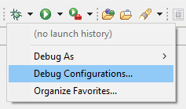
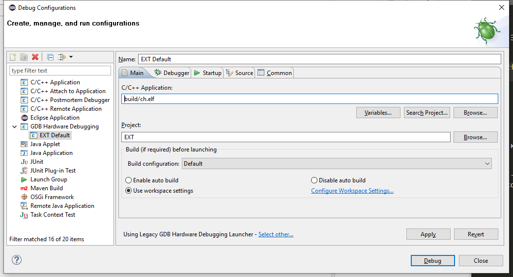
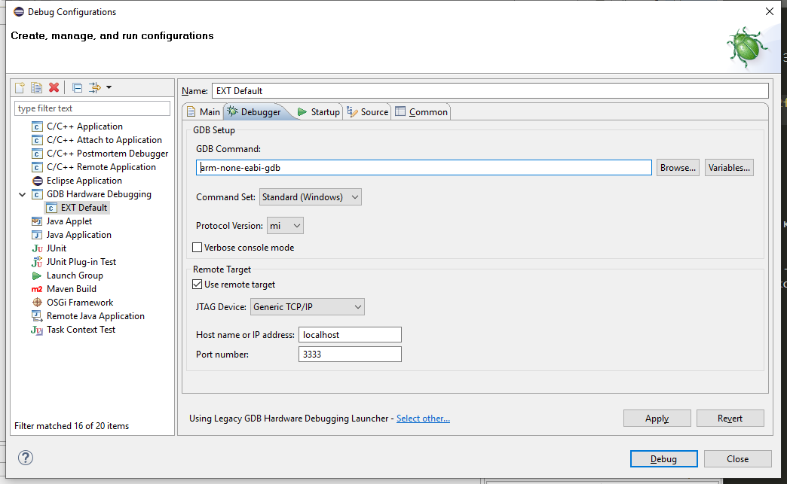
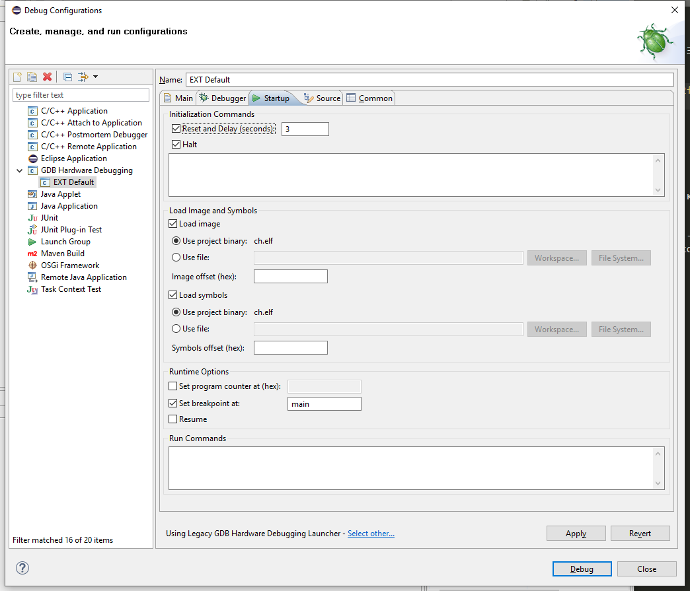
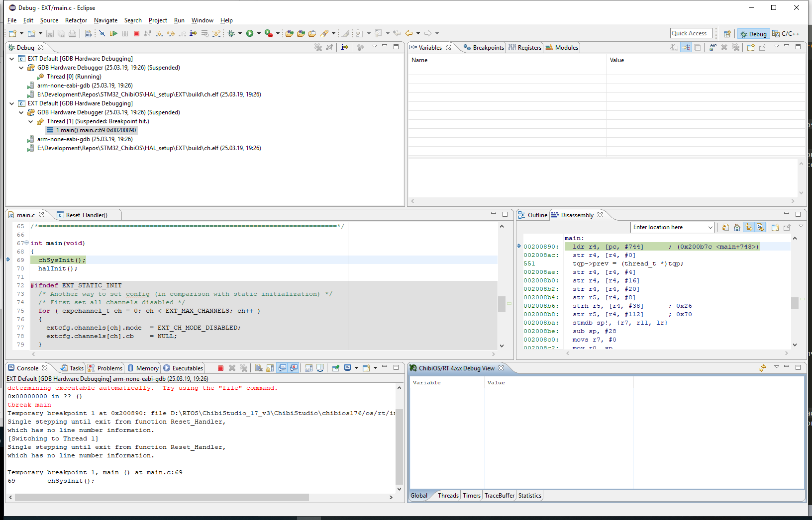
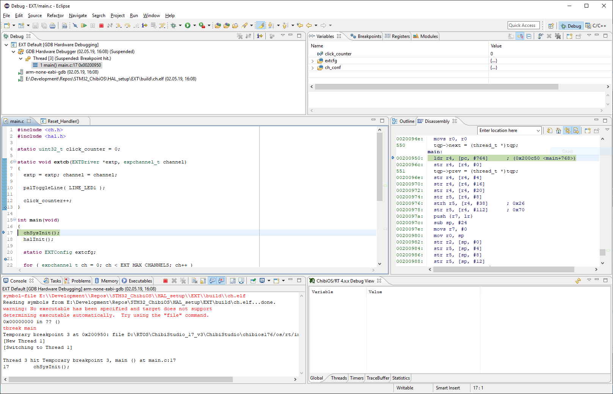

# Отладка кода на контроллере STM32F7x с использованием Eclipse в качестве IDE

Процесс отладки на конроллере STM32 происходит по принципу удаленной отладки, что означает, что существует сервер, который подключается к контроллеру, и клиент, которым в нашем случае является утилита `arm-none-eabi-gdb` - стандартный GDB отладчик из набора GNU инструментов. Клиент посылает стандартные для отладки команды, а сервер, получая их, преобразует в соответствующие команды контроллера.

## Запуск сервера отладки 

Запуск сервера производится при подключенном контроллере.

### Windows

Здесь все просто, из среды Eclipse запустите скрипт, который в настоящее время есть во всех шаблонах проектов - `openocd_debug.bat`.

### Linux

> TODO - Нужна проверка работоспособности

Для работы нужна утилита `openocd`, которая как раз кстати стоит в готовом пакете. Запуск сервера производится командой:
```bash
openocd -s "$CHIBISTUDIO/tools/openocd/scripts" -f board/st_nucleo_f7.cfg -c "stm32f7x.cpu configure -rtos auto;"
```

Для обоих ОС этого достаточно, чтобы запустить сервер отладки. 

## Настройка среды Eclipse

Вариант настройки среды будет рассматриваться на примере проекта `HAL_setups/EXT`, который есть в репозитории. Такая настройка универсальная, так как производится для Eclipse.

Для отладки используется расширение Eclipse под названием `GDB Hardware Debugging` - оно уже установлено в подготовленной среде. Запускаем `Debug Condigurations...` и создаем конфигурация `GDB Hardware Debugging`.

<p align="center">

</p>

Настраиваем в соответствии с настройками:

<p align="center">

</p>

Указали бинарный файл для работы с ним `ch.elf`, остальное - по-умолчанию.

<p align="center">

</p>

Указали утилиту GDB для нашей платформы и порт сервера, остальное - по-умолчанию.

<p align="center">

</p>

Не хотите прошивать контроллер при запуске отадки? - Уберите галочку с `Load image`. `Set breakpoint at: main` установлен, чтобы программа остановилась на начале программы.

Все остальное оставляем по-умолчанию.

После настройки не закрывайте окно, а нажмите на кнопки `Apply`, а затем `Debug`, что позволит далее запускать конфигурацию из кнопки "жука".

## Процесс отладки

> Иногда отладка может начаться с остановки в функции `Reset_Handler`, пропускайте шаги до тех пор, пока не попадете на начало функции main().

В результате начала отладки должно появиться окно с указанием места отладки в программе:
<p align="center">

</p>


## ChibiOS info

Снизу справа видно окно параметров ChibiOS, в котором отображается инфа о состоянии системы, правда работает она только после исполнения исполнения функции `chSysInit()`. Для получения актуальной информации необходимо нажать на кнопочку "Обновить" в верхнем правом углу окошечка (виджета):
<p align="center">

</p>

