# Установка и настройка Eclipse для работы с STM32 Nucleo-F767ZI

# Скачать ПО

Зайти на сетевую папку (явки, пароли взять у доверенного лица :sunglasses:)

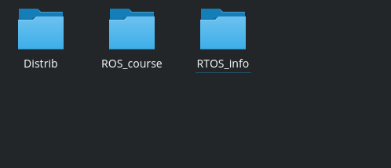

Скачать 3 файла:  
+ архив Distrib_STM32.zip  
+ архив ChibiStudio_v0.7z  
+ текстовый файл Links.txt  

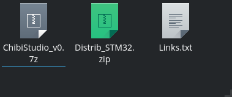

Сохранить файлы лучше подближе к корневому диску. Например, `D:\RTOS`
Потому что часто на Винде возникают проблемы, если в пути есть русские символы, то компиляция фэйлится. 

# Файл Links.txt и почему он такой клёвый 

В данном файле находится 3 ссылочки, которые сделают вашу жизнь проще и комфортнее. 

1. [https://www.sublimetext.com/3](https://www.sublimetext.com/3) - ссылка на установщик текстового редактора Sublime Text. Его не обязательно устанавливать, это просто рекомендация, потому что он весьма удобный и тёмная тема - ну, вы понимаете :wink: 

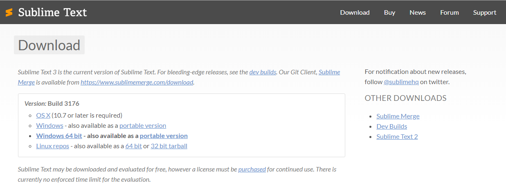

По ссылке откроется страница, где в графе **Downloads** нужно выбрать свою систему и следуя инструкциям установить редактор. 

2. [https://sourceforge.net/projects/chibios/files/ChibiStudio/](https://sourceforge.net/projects/chibios/files/ChibiStudio/) - ссылка на расположение архива с Eclipse, ChibiOS_18.2.1  и со всеми остальными инструментами. 

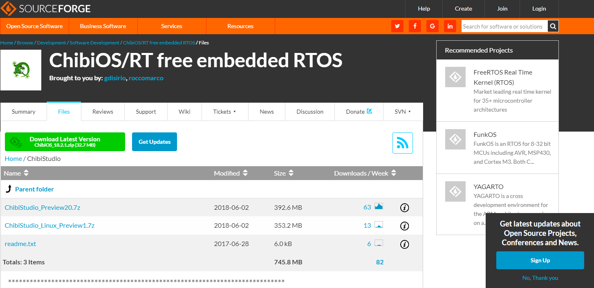

Мы будем пользоваться другим архивом с ChibiOS_17.6, который любезно подготовлен [KaiL4eK](https://github.com/KaiL4eK), этот архив немного урезан и протестирован.

По представленной ссылке можно скачать новую версию, архив будет очень похож на наш, но не факт, что версии будут сходиться, так как от версии к версии могут вноситься изменения и могут быть несостыковки. 

3. [https://github.com/KaiL4eK/STM32F767ZI_ChibiOS_template](https://github.com/KaiL4eK/STM32F767ZI_ChibiOS_template) - ссылка на GitHub-репозиторий с шаблоном проекта для ChibiOS

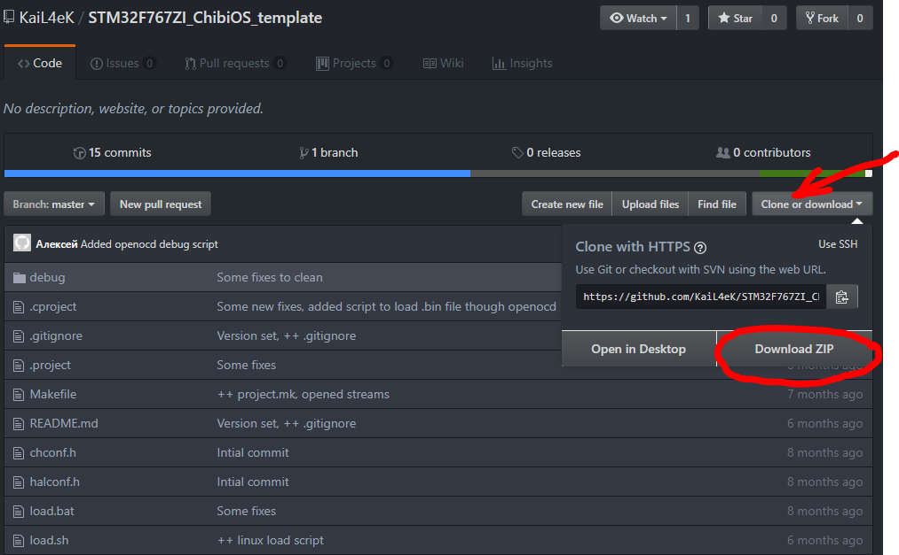

В репозитории нужно нажать на кнопку "Clone or download" - "Download Zip" и скачать его в папку, в которой лежат файлы из сетевой папки. 

# Подготовка к работе 

Распакуйте архив Distrib_STM32.zip и шаблон проекта для ChibiOS в одну папку. 

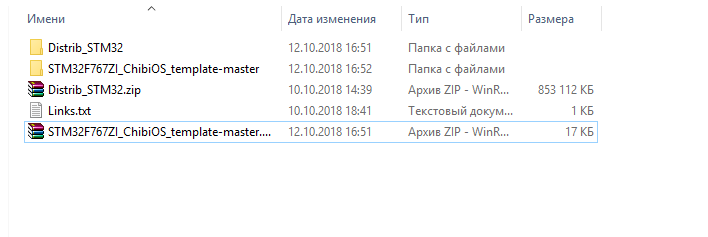

Перейдите в дистрибутив (папку Distrub_STM32). 

- Первое, что нужно установить - **jre-8u161-windows-i586.exe** - это Java Runtime, он нужен для Eclipse и без него работать не будет. **-i586** нужен под разрядность x32, тот Eclipse, который распологается в архиве, ориентирован на систему х32 (разработчики взяли минимальную версию системы).

- Распакуйте архив **en.stsw-link004.zip** - утилита для взаимодействия с микроконтроллером STM. Установите утилиту, сразу с этой утилитой установятся и драйвера. 

Затем распакуйте архив **ChibiStudio_v0.7z** - это "урезанная" версия ChibiStudio, в ней меньше папочек, а именно: 

- папка **chibios176** - это библиотека (framework), где располагается сама ChibiOS версия 17.6
- папка **eclipse** - папка *угадайте с чем? ^_^* с Eclipse (наше IDE)
- папка **tools** - папка с инструментами для компиляции и отладки
- папка **workspace176** - директория, в которой будут располагаться рабочие проекты, кроме того, в ней расположены настройки для Eclipse. То есть она является основной папкой, куда мы будем класть наши проекты. 
- ярлык **Chibi Studio GCC 6.3** - ярлык на IDE, но поскольку папка всё время меняет своё расположение, он не работает, чтобы это поправить, нужно указать правильное расположение папки, либо (что и рекомендуется делать) использовать утилиту start_gcc63.bat

# Настройка первого проекта 

С помощью скрипта start_gcc63.bat запустите Eclipse. 

1. Настройка Workspace - укажите путь до папки workspace176 внутри распакованной папки (в которой вы будете работать).

Если среда сразу не предложила указать где находится workspace, то это можно сделать File - Switch Workspace - Other 

После этого произойдёт перезапуск IDE - так что не пугайтесь 

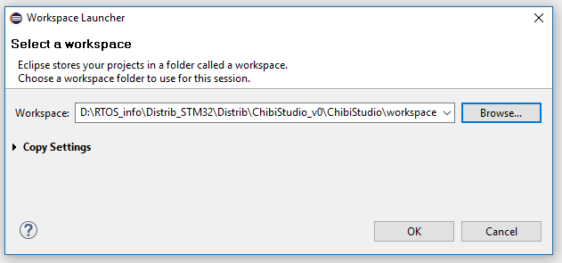

С этого момента настройка IDE завершена, можно начинать работать с проектами. 

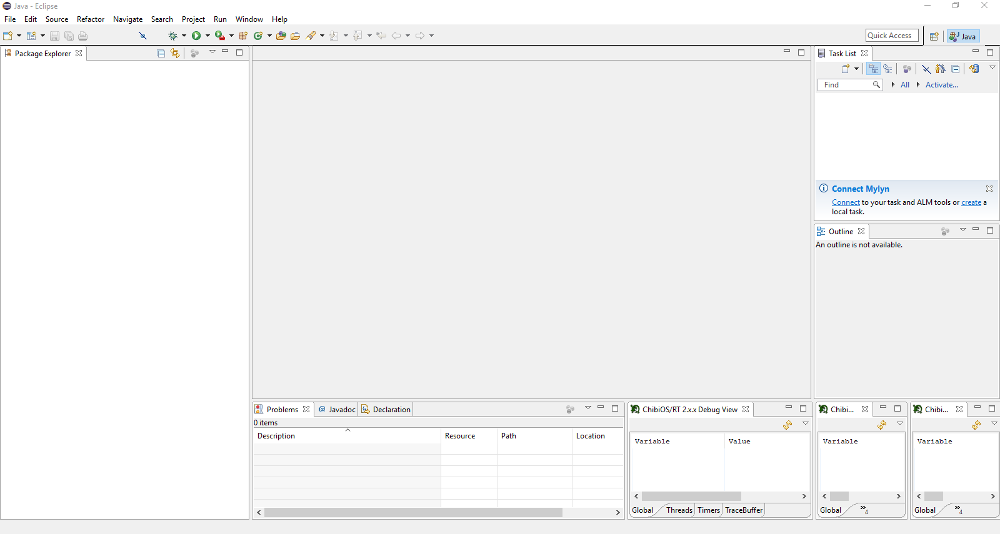

2. Настройка проекта ChibiOS.

Проекты для ChibiOS разрабатывались с использованием открытого исходного кода, поэтому проект базируется на системе сборки Make. Поэтому в Eclipse нет плагина, который позволяет нам привычно нажать кнопки New - Project ... Именно из-за этого был создан [репозиторий](https://github.com/KaiL4eK/STM32F767ZI_ChibiOS_template). 

- Ранее скаченную папку **STM32F767ZI_ChibiOS_template-master** переносим в папку **workspace176**.

> Это может показаться не очень удобным способом, но при создании проекта с нуля и настройки его, вы ощутите намного больше боли и страданий, нежели просто скопировав заранее настроенную папку-шаблон :grinning:. 

- Если вы перенесли архив с шаблоном в папку **workspace176**, то распакуйте его в папку с именем **STM32F767ZI_ChibiOS_template-master**.

Для дальнейшего удобства в папке **workspace176** всегда можно хранить архив **STM32F767ZI_ChibiOS_template-master** и разархивировать его в тот момент, когда понадобится новый проект. 

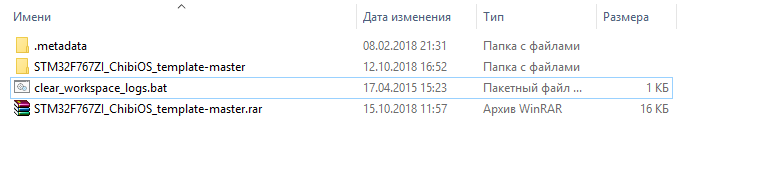

> Стоит отметить, что данный шаблон подходит под конкретную плату STM32F767ZI. 

### Изменение имени проекта. 
1. Переименовать папку **STM32F767ZI_ChibiOS_template-master** (желательно без содержания русских символов)
2. Так как Eclipse при открывании папки смотрит на файл с настройкой, то нужно его также изменить.  
- Открыть Sublime Text и открыть там папку с проектом  
- Открыть файл .project

- В данной файле поменять название проекта под тэгами `<name>` 

	

Теперь Eclipse готов для работы с новым проектом. 

# Открытие проекта в Eclipse

1. File - Import - General - Existing Projects into Workspace  - **Next** 

2. Указать путь, где лежить проект Select root directory: - Browse...  - **Finish**

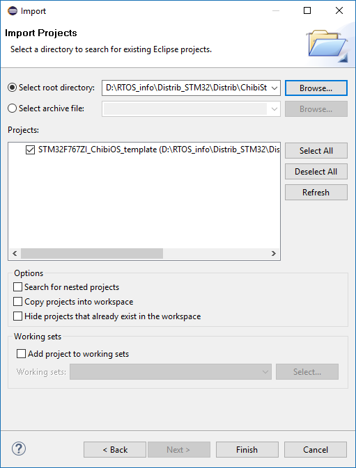

Импорт проекта закончен :dancers: 

# Работа с проектом в Eclipse

В Package Explorer открылась папка проекта и его дерево файлов 

- файл README.md - это файл с указанием "лицензии", можно написать туда описание проекта
- файл project.mk - этот файл был создан для того, чтобы в него добавлять свои собственные файлы. Например, если вы создаёте новый файл (для собственной библиотеки или модуля), то здесь можно и нужно его добавить, тогда компилятор будет видеть его.

> Если создаёте c - файл , то добавить его нужно в переменную `PROJECT_CSRS`; cpp - в переменную `PROJECT_CPPSRS`

> Переменная `PROJECT_INCDIR` содержит пути до папок с заголовочными файлами. Не нужно перечислять заголовочные файлы, которые вы используете, нужно указать лишь пути до папок!

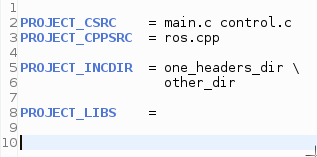

> Переменную `PROJECT_LIBS` пока не будем рассматривать, она нужна для использовать библиотек

- файл openocd_debug.bat - используется для отладки 

- файл Makefile - файл, который используется для сборки проекта (он был написан разработчиками ChibiOS), [KaiL4eK](https://github.com/KaiL4eK) же внёс некоторые изменения. Если вы программируете конкретную плату **STM32F767ZI** и используете архив **ChibiStudio_v0.7.z**, то этот файл уже настроен на неё, менять ничего не нужно. 

- файл load.sh - скрипт для загрузки проекта непосредственно в плату STM для системы Linux

- файл load.bat - скрипт для загрузки проекта непосредственно в плату STM для системы Windows

- файл main.c - ну, собственно, основной файл, в котором пишется код :sweat_smile: 

- файлы chconf.h, halconf.h, mcuconf.h - файлы, которые относятся к конфигурации ChibiOS

- папка os - в ней содержится папка с ссылкой на папку внутри ChibiOS 

- папка debug - содержит настройки для отладки 

- папка board - ссылка на папку внутри ChibiOS 

# Наконец-то программирование 

В файле `main.c` содержится основной код и функция `main`. 

В этой файле добавлены заголовочные файлы ChibiOS: сh.h и hal.h и стандартный заголовочный файл - chprintf.h 

Также, там есть код потока `Thread` (строки 6 - 15).

В коде `main` строки 19-20 - инициализация ядра RT (Real-Time) и инициализация HAL (Hardware Abstraction Level). 

Строка 22 - создание нового потока.

Для тестового примера удалите код потока и его создание. Давайте напишем программу, которая позволит нам мигать светодиодом LED1, встроенного на плату. 

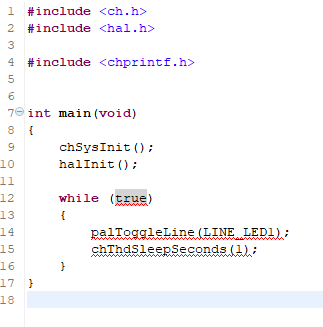

Когда код написан используя горячие клавиши Ctrl+S (или Save) **сохраняем код**, так как по умолчанию код не сохраняется. Это можно настроить. 

Дальше, нужно собрать проект Project - Build Project (или молоточек). Внизу в консоли появится вывод, если ошибок компиляции нет, то можно пробовать загружать проект на плату. 

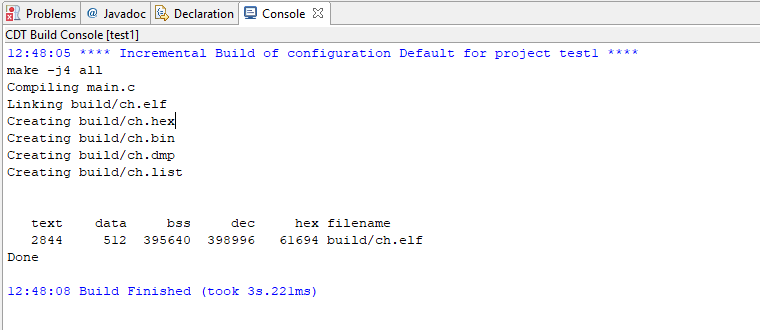

Ошибок нет, Вы восхитительны :bowtie:

# Загрузка кода в микроконтроллер 

Есть 2 способа загрузки кода в микроконтроллер

1. Использовать load.bat / load.sh (в зависимости от вашей системы). 2 раза щёлкнули по скрипту, на плате должен замигать сигнальный диодик (он меняет цвет с зелёного на оранжевый и обратно). Программа загружена. 

> Не самый очевидный способ, но зато самый простой 

2. Открыть проводник - наш проект - папка build - файл .bin и отправим его на флэшку (плату)  

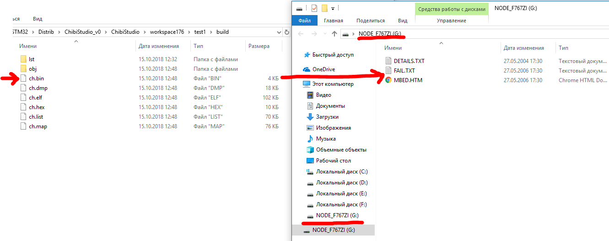

# Что такое ChibiStudio_Preview19.7.z?

Архив **ChibiStudio_Preview19.7.z** - директория с папками. Разработчик всегда предоставляет 2 версии ChibiOS: ChibiOS_1.6.1. и ChibiOS_1.7.6. (в случае с ChibiOS_17.6), 2 версии компилятора: GCC 4.7 и GCC 6.3 (можно использовать любой из них)

