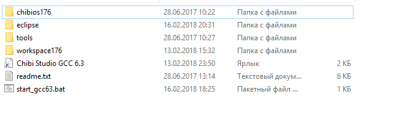
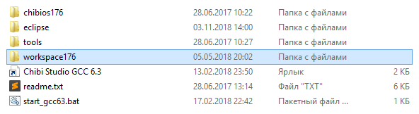
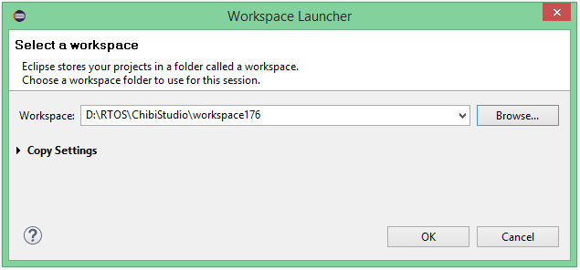
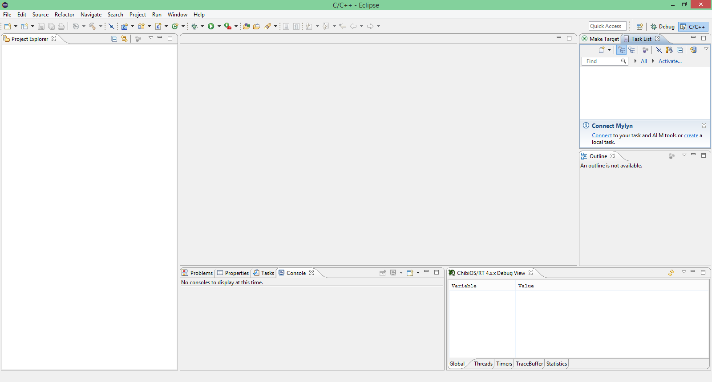
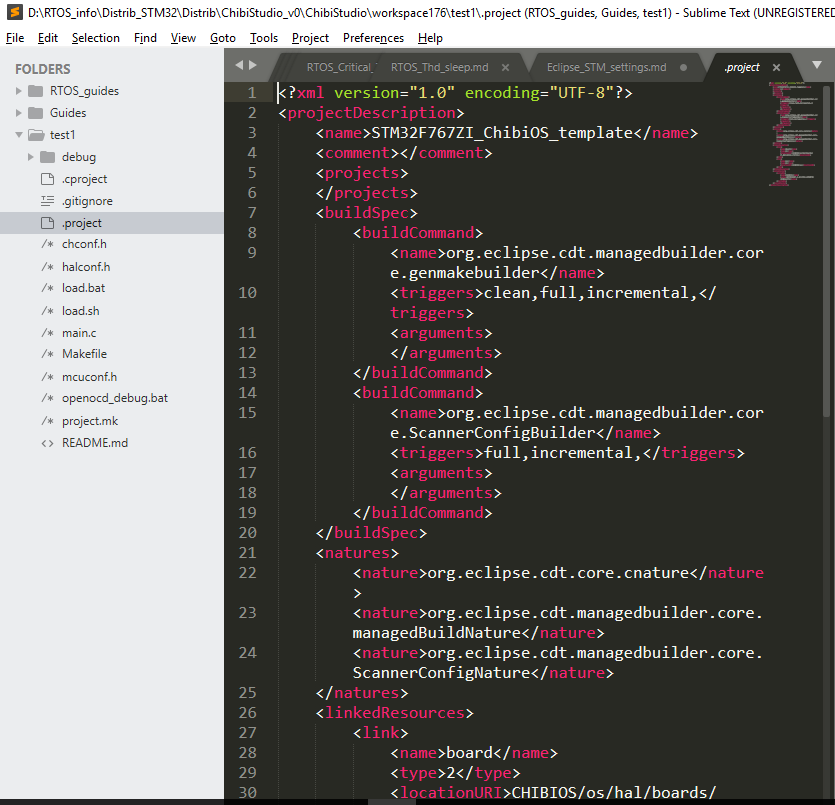
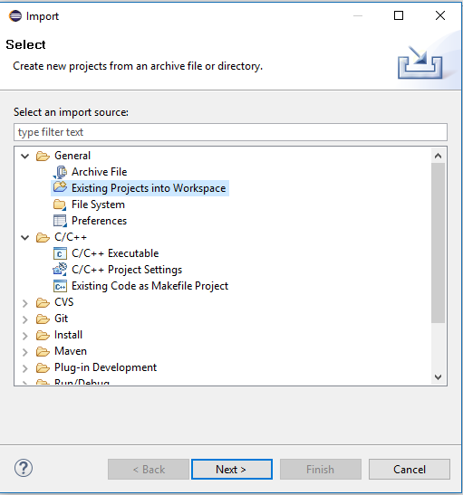
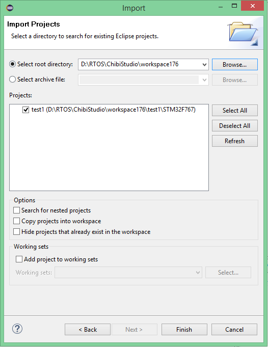
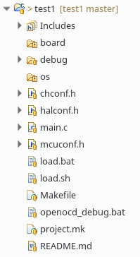

# Установка и настройка Eclipse для работы с STM32 Nucleo-F767ZI под Windows

# Скачать ПО

Качаем из этой [папки на облаке](http://maddriveteam.duckdns.org:8000/d/636f89c044664e659fb8/) архивы:  
+ **ChibiStudio_v1.zip** - настроенная IDE на основе Eclipse  
+ **en.stsw-link004.zip** - утилита взаимодействия с STM32 + дровишки  
+ **STM32F767_template_v1.zip** - шаблон проекта для Eclipse  

Сохранить файлы лучше подближе к корневому диску. Например, `D:\RTOS`
Потому что часто на Винде возникают проблемы, если в пути есть русские символы, то компиляция фэйлится. 

# Подготовка к работе 

1. Распакуйте архив **en.stsw-link004.zip** - утилита для взаимодействия с микроконтроллером STM. Установите утилиту, сразу с этой утилитой установятся и драйвера. 

2. Для Eclipse понадобится x32 версия JRE (Java SE Runtime Environment). Ее можно скачать с [сайта Oracle](https://www.oracle.com/technetwork/java/javase/downloads/jre8-downloads-2133155.html) или, если ссылка не работает, [нагуглить самому](http://lmgtfy.com/?q=Java+SE+Runtime+Environment). Скачать небходимо под Windows версии **i586**. Название установки должно напоминать что-то типа `jre-8u191-windows-i586.exe`.

> Версия i586 используется, так как Eclipse в архиве 32х битный - чтобы запускался на любом компе.

После скачивания будьте добрый установить Java =)

3. Распакуйте архив **ChibiStudio_v1.zip** - это "урезанная" версия ChibiStudio, в ней меньше папочек, а именно: 

- папка **chibios176** - это библиотека (framework), где располагается сама ChibiOS версии 17.6
- папка **eclipse** - папка *угадайте с чем? ^_^* с Eclipse (наше IDE)
- папка **tools** - папка с инструментами для компиляции и отладки
- папка **workspace176** - директория, в которой будут располагаться рабочие проекты, кроме того, в ней расположены настройки для Eclipse. То есть, она является основной папкой, куда мы будем класть наши проекты. 
- ярлык **Chibi Studio GCC 6.3** - ярлык на IDE, но поскольку папка всё время меняет своё расположение, он не работает, чтобы это поправить, нужно указать правильное расположение папки, либо (что и рекомендуется делать) использовать утилиту start_gcc63.bat

# Настройка первого проекта 

С помощью скрипта `start_gcc63.bat` запустите Eclipse. 

1. Настройка Workspace - укажите путь до папки `workspace176` внутри распакованной папки (в которой вы будете работать).

Если среда сразу не предложила указать где находится workspace, то это можно сделать `File - Switch Workspace - Other`

После этого произойдёт перезапуск IDE - так что не пугайтесь =)

С этого момента настройка IDE завершена, можно начинать работать с проектами. 

2. [Настройка проекта ChibiOS.](New_project.md)

### Установка нового имени проекта
1. Переименовать папку **STM32F767_template_v1** (желательно без содержания русских символов) в желаемое название проекта.
2. Так как Eclipse при открытии папки смотрит на файл с настройкой, то нужно отредактировать файл `.project`:

- В данной файле поменять название проекта под тэгами `<name>` 

	

Теперь Eclipse готов для работы с новым проектом. 

# Открытие проекта в Eclipse

1. File - Import - General - Existing Projects into Workspace  - **Next** 

2. Указать путь, где лежить проект Select root directory: - Browse...  - **Finish**

Импорт проекта закончен :dancers: 

# Работа с проектом в Eclipse

В Package Explorer открылась папка проекта и его дерево файлов 

- файл README.md - это файл с указанием "лицензии", можно написать туда описание проекта
- файл project.mk - этот файл был создан для того, чтобы в него добавлять свои собственные файлы. Например, если вы создаёте новый файл (для собственной библиотеки или модуля), то здесь можно и нужно его добавить, тогда компилятор будет видеть его.

> Если создаёте c - файл , то добавить его нужно в переменную `PROJECT_CSRS`; cpp - в переменную `PROJECT_CPPSRS`

> Переменная `PROJECT_INCDIR` содержит пути до папок с заголовочными файлами. Не нужно перечислять заголовочные файлы, которые вы используете, нужно указать лишь пути до папок!

> Проверьте, что в файле project.mk находятся имена только тех файлов, которые действительно существуют в вашем проекте. *Файлы `contol.c`, `ros.cpp`, `other_dir` приведены только как пример!* 

> Переменную `PROJECT_LIBS` пока не будем рассматривать, она нужна для использовать библиотек

- файл openocd_debug.bat - используется для отладки 

- файл Makefile - файл, который используется для сборки проекта (он был написан разработчиками ChibiOS), [KaiL4eK](https://github.com/KaiL4eK) же внёс некоторые изменения. Если вы программируете конкретную плату **STM32F767ZI** и используете архив **ChibiStudio_v0.7.z**, то этот файл уже настроен на неё, менять ничего не нужно. 

- файл load.sh - скрипт для загрузки проекта непосредственно в плату STM для системы Linux

- файл load.bat - скрипт для загрузки проекта непосредственно в плату STM для системы Windows

- файл main.c - ну, собственно, основной файл, в котором пишется код :sweat_smile: 

- файлы chconf.h, halconf.h, mcuconf.h - файлы, которые относятся к конфигурации ChibiOS

- папка os - в ней содержится папка с ссылкой на папку внутри ChibiOS 

- папка debug - содержит настройки для отладки 

- папка board - ссылка на папку внутри ChibiOS 

# Наконец-то программирование 

В файле `main.c` содержится основной код и функция `main`. 

В этой файле добавлены заголовочные файлы ChibiOS: сh.h и hal.h и стандартный заголовочный файл - chprintf.h 

Также, там есть код потока `Thread` (строки 6 - 15).

В коде `main` строки 19-20 - инициализация ядра RT (Real-Time) и инициализация HAL (Hardware Abstraction Level). 

Строка 22 - создание нового потока.

Для тестового примера удалите код потока и его создание. Давайте напишем программу, которая позволит нам мигать светодиодом LED1, встроенного на плату. 

Когда код написан используя горячие клавиши Ctrl+S (или Save) **сохраняем код**, так как по умолчанию код не сохраняется. Это можно настроить. 

Дальше, нужно собрать проект Project - Build Project (или молоточек). Внизу в консоли появится вывод, если ошибок компиляции нет, то можно пробовать загружать проект на плату. 

Ошибок нет, Вы восхитительны :bowtie:

# Загрузка кода в микроконтроллер 

Есть 2 способа загрузки кода в микроконтроллер

1. Использовать load.bat / load.sh (в зависимости от вашей системы). 2 раза щёлкнули по скрипту, на плате должен замигать сигнальный диодик (он меняет цвет с зелёного на оранжевый и обратно). Программа загружена. 

> Не самый очевидный способ, но зато самый простой 

2. Открыть проводник - наш проект - папка build - файл .bin и отправим его на флэшку (плату)  

