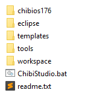
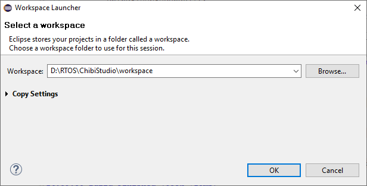
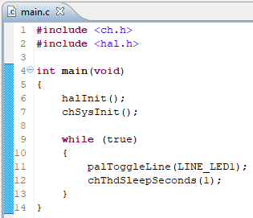

# Установка и настройка Eclipse для работы с STM32 Nucleo-F767ZI под Windows

# Скачать ПО

Качаем из этой [папки на облаке](https://disk.yandex.ru/d/awki7AnoKNxiuA/Releases) архивы:  
+ **ChibiStudio20v0_windows.zip** (в папке rc) - настроенная IDE на основе Eclipse  
+ **en.stsw-link004.zip** - утилита взаимодействия с STM32 + дровишки 

Сохранить файлы лучше подближе к корневому диску. Например, `D:\RTOS`
> Часто возникают проблемы, если в пути есть русские символы, то компиляция фэйлится. 

# Подготовка к работе 

1. Распакуйте архив **en.stsw-link004.zip** - утилита для взаимодействия с микроконтроллером STM. Установите утилиту, сразу с этой утилитой установятся и драйвера. 

2. Для Eclipse понадобится x32 версия JRE (Java SE Runtime Environment). Ее можно скачать с [сайта Oracle](https://www.oracle.com/technetwork/java/javase/downloads/jre8-downloads-2133155.html) или, если ссылка не работает, [нагуглить самому](http://lmgtfy.com/?q=Java+SE+Runtime+Environment). Скачать небходимо под Windows версии **i586**. Название установки должно напоминать что-то типа `jre-8u191-windows-i586.exe`.

> Версия i586 используется, так как Eclipse в архиве 32х битный - чтобы запускался на любом компе.

После скачивания будьте добрый установить Java =)

3. Распакуйте архив **ChibiStudio20v0_windows.zip** - это "урезанная" версия ChibiStudio, в ней меньше папочек, а именно: 

- папка **chibios203* - это библиотека (framework), где располагается сама ChibiOS версии 20.3;
- папка **eclipse** - папка *угадайте с чем? ^_^* с Eclipse (наше IDE);
- папка **tools** - папка с инструментами для компиляции и отладки;
- папка **templates** - папка с инструментами для компиляции и отладки;
- папка **workspace** - директория, в которой будут располагаться рабочие проекты, кроме того, в ней расположены настройки для Eclipse, *является основной папкой, куда мы будем класть наши проекты*;
- папка **templates** - папка с шаблонами новых проектов под разные модели плат;
- скрипт **ChibiStudio.bat** - основной скрипт запуска ChibiStudio.

# Настройка среды разработки

С помощью скрипта `ChibiStudio.bat` запустите Eclipse. 

Если всплыло окно:

В таком случае необходимо указать **абсолютный** путь до папки `workspace`.

Если среда сразу не предложила указать где находится workspace, то это можно сделать через: File -> Switch Workspace -> **Other...**.

> После этого произойдёт перезапуск IDE - так что не пугайтесь =)

С этого момента настройка IDE завершена, можно начинать работать с проектами. 

# Hello LED!

Для примера и проверки работоспособности среды создайте новый проект по [инструкции](../ProjectTemplates/New_project.md).

Теперь давайте напишем программу, которая позволит нам мигать светодиодом LED1, встроенного на плату. 

> Не то, чтобы мы издевались, но картинка вставлена специально, чтобы Вы сами пописали код :sweat_smile:

После этого соберите проект, залейте на контроллер и наслаждайтесь миганием.

Если ошибок нет, Вы восхитительны и поздравляем с началом работы! :bowtie:
